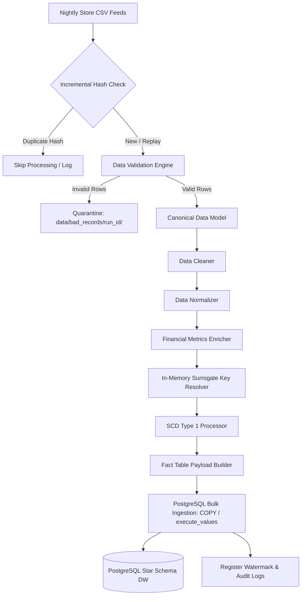

# RetailFlow ETL 🚀
> **Enterprise Sales Data Warehouse Pipeline**

[](https://github.com/retailflow/retailflow-etl/actions/workflows/ci.yml)
[](https://www.python.org/)
[](#license)

RetailFlow ETL is a production-grade, enterprise sales data warehouse pipeline built with **Python**, **Pandas**, and **PostgreSQL**. Designed to simulate a retail enterprise processing nightly Point-of-Sale (POS) exports from **250+ store locations**, RetailFlow enforces modular data quality validation, normalizes incoming feeds into a Canonical Data Model, resolves surrogate keys via in-memory caching, and bulk loads a PostgreSQL Star Schema warehouse within atomic transaction boundaries.

---

## 🌟 Key Features

- 🏗️ **Medallion Architecture & Star Schema**: Maps Bronze (Raw CSV) → Silver (Validated Data) → Gold (Dimensional Warehouse: `dim_customer`, `dim_product`, `dim_store`, `dim_employee`, `dim_date`, and partitioned `fact_sales`).
- 🛡️ **Data Quality Validation & Quarantine**: Vectorized schema enforcement, datatype coercion, and domain rule checks (`quantity > 0`, non-negative prices, future date prevention). Quarantines invalid records per run to `data/bad_records/<run_id>/`.
- ⚡ **High-Performance Bulk Ingestion**: Supports streaming `COPY FROM STDIN` and `psycopg2.extras.execute_values` chunked batch loading achieving **>25,000 rows/sec** throughput.
- 🔁 **Incremental Processing & Idempotency**: High-watermark tracking and SHA-256 file content hashing prevent duplicate ingestion and enable manual operator replay.
- 📊 **Data Quality Scorecards**: Generates weighted Data Quality Scorecards (0 - 100%) across Completeness, Validity, Uniqueness, Consistency, Conformity, and Freshness.
- 🔒 **Sensitive Data Redaction**: Automatic masking of passwords, secrets, and connection URIs in structured JSON log files.
- 🖥️ **Production Operational CLI**: CLI runner supporting `--config`, `--env`, `--batch-size`, `--replay`, `--dry-run`, `--validation-only`, and standardized exit codes (`0` - `6`).

---

## 🏛️ Pipeline Architecture



---

## 🚀 Quick Start Guide

### 1. Prerequisites
- Python `>= 3.9`
- PostgreSQL `>= 13`

### 2. Environment Setup
```bash
# Clone repository
git clone https://github.com/retailflow/retailflow-etl.git
cd retailflow-etl

# Create virtual environment and install dependencies
python3 -m venv venv
source venv/bin/activate
pip install -r requirements.txt
```

### 3. Run Pipeline via Operational CLI
```bash
# Execute dry-run mode (Validation & Transformation without DB commits)
python -m retailflow.cli --dry-run --file sample_data/small/sales_1k.csv

# Execute full pipeline in development environment
python -m retailflow.cli --config config/development.yaml --file sample_data/small/sales_1k.csv
```

### 4. Run Test Suite & Benchmarks
```bash
# Run unit, integration, and E2E test suites
pytest tests/unit tests/integration tests/e2e

# Run performance benchmarks
python benchmarks/run_benchmarks.py
```

---

## 📁 Repository Structure

```text
retailflow-etl/
├── config/                  # Multi-environment configuration profiles (base, dev, prod, testing, local)
├── data/                    # Data staging lifecycle (raw, staging, processed, archive, bad_records)
├── docs/                    # Architecture, design decisions, ADRs, database DDL guides, operations runbook
│   ├── adr/                 # Architecture Decision Records (ADR-001 through ADR-007)
│   ├── architecture_review.md
│   ├── incremental_loading.md
│   ├── operations_runbook.md
│   ├── postgresql_performance.md
│   ├── project_showcase.md
│   └── transformation_rules.md
├── sample_data/             # Reusable sample datasets (small, medium, invalid, duplicates)
├── sql/                     # PostgreSQL DDL & DML scripts (ddl/, dml/, views/, functions/)
├── src/retailflow/          # Main Python application package
│   ├── audit/               # Operational audit subsystem, timeline engine, and publishers
│   ├── config/              # Layered YAML configuration loader & semantic validation
│   ├── database/            # PostgreSQL connection pool & transaction manager
│   ├── exceptions/          # Structured domain exception hierarchy
│   ├── health/              # Pre-flight environment & dependency health checker
│   ├── incremental/         # Incremental watermark manager, change detector & state checkpoints
│   ├── loader/              # Dimension loader, fact loader, bulk utilities, transaction coordinator
│   ├── metrics/             # Operational performance metrics collector
│   ├── models/              # Canonical Data Model (CDM), validation, loader, & scorecard DTOs
│   ├── transformation/      # Cleaner, normalizer, enricher, surrogate key resolver, SCD1
│   ├── utils/               # Structured JSON logger & sensitive data redactor
│   ├── validation/          # Modular quality validators & Data Quality Scorecard generator
│   └── cli.py               # Operational Command-Line Interface runner
├── tests/                   # Test suite (unit/, integration/, e2e/, harness/)
├── benchmarks/              # Performance throughput & memory profiling suite
├── pyproject.toml           # Project metadata & linter configuration
├── requirements.txt         # Production dependency pins
└── README.md                # Project README documentation entry point
```

---

## 📚 Documentation Index
- 📖 [Project Showcase & Interview Guide](docs/project_showcase.md)
- 📐 [Architecture Review & Design Trade-offs](docs/architecture_review.md)
- 🛠️ [Operations Engineering Runbook](docs/operations_runbook.md)
- ⚡ [PostgreSQL Bulk Performance & Tuning](docs/postgresql_performance.md)
- 🔄 [Incremental Processing & Watermarking Guide](docs/incremental_loading.md)
- 📑 [Transformation Rules Specification](docs/transformation_rules.md)
- 🏛️ [Warehouse Star Schema Design](docs/05_warehouse_design.md)
