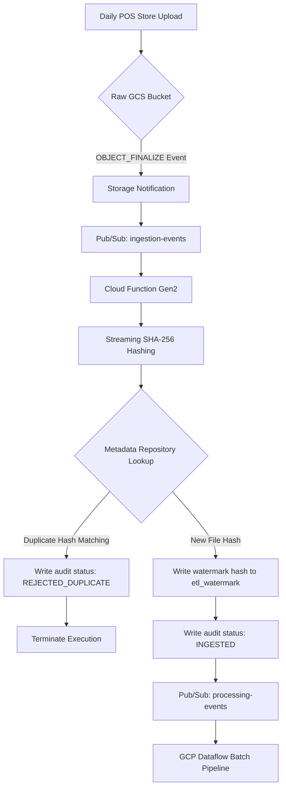

# RetailFlow ETL 🚀
> **Enterprise Sales Data Warehouse Pipeline & Cloud Migration**

[](https://www.python.org/)
[](https://www.terraform.io/)
[](#license)

RetailFlow ETL v2.0 is a production-grade, enterprise sales data warehouse pipeline. Originally built as an on-premises pipeline (Python, Pandas, PostgreSQL), it is currently undergoing a **cloud-native migration to Google Cloud Platform (GCP)**. The migrated platform shifts processing from scheduled batch scripts to an event-driven serverless ingestion and batch Dataflow (Apache Beam) processing architecture, landing clean medallion data into **Google BigQuery**.

Designed to simulate a retail enterprise processing nightly Point-of-Sale (POS) exports from **250+ store locations**, RetailFlow enforces modular data quality validation, normalizes incoming feeds into a Canonical Data Model, resolves surrogate keys via in-memory caching, and bulk loads a BigQuery Star Schema warehouse.

---

## 🏛️ Cloud Ingestion Architecture (Vertical Slice 1)



---

## 🌟 Key Features

- 🏗️ **Medallion Architecture & Star Schema**: Maps Bronze (Raw GCS) → Silver (Validated canonical BigQuery) → Gold (Dimensional Warehouse: `dim_customer`, `dim_product`, `dim_store`, `dim_employee`, `fact_sales`).
- 🛡️ **Data Ingestion Duplication Guards**: Instantly flags repeat uploads at the trigger boundary via SHA-256 content hashes, stopping run executions before spinning up compute resources.
- ⚡ **Chunk-Based Hashing Streams**: Reads GCS files in 256KB segments, maintaining a small memory footprint safe for multi-GB files.
- 🔄 **Distributed Correlation Tracing**: Passes `correlation_id` values across Cloud Function JSON logs and Pub/Sub headers to trace query lineage from GCS to BigQuery tables.
- 🔒 **Stateless Serverless Ingestion**: The ingestion Cloud Function is stateless, coordinating queries via decoupled repository interfaces.

---

## 🛠️ Technology Stack
- **Languages**: Python `3.9` / `3.12`
- **GCP Services**: Google Cloud Storage, Pub/Sub, Cloud Functions (Gen2), Cloud Dataflow (Apache Beam), BigQuery
- **Infrastructure as Code**: Terraform `>= 1.5`
- **Testing**: pytest (complete mocks for GCP APIs)

---

## 🚀 Migration Roadmap

### 📦 Milestone 1: Core Storage & Dataset Scaffolding (COMPLETED)
- Provisioned Raw, Archive, and Quarantine GCS buckets.
- Provisioned BigQuery Medallion datasets (`bronze`, `silver`, `gold`, `metadata`).

### 📥 Vertical Slice 1: Event-Driven File Ingestion (COMPLETED)
- Provisioned GCS-to-Pub/Sub trigger notifications.
- Created stateless Cloud Function Gen2 runtime wrapper.
- Implemented `MetadataRepository` BigQuery adapter.
- Implemented streaming SHA-256 file hashing.

### ⚙️ Vertical Slice 2: Batch Processing Pipeline (IN PROGRESS)
- Adapt the existing validation and transformation engine into a Cloud Dataflow (Apache Beam) pipeline.
- Write verified transactional records into BigQuery Silver canonical datasets.

### 📊 Vertical Slice 3: Warehouse Modeling (PLANNED)
- DDL tables instantiation for Gold dimension and facts.
- BigQuery SQL MERGE procedures mapping Silver natural keys to Gold surrogate keys.

### 🔒 Vertical Slice 4: Platform Operations (PLANNED)
- IAM policies, Service Accounts, metrics dashboards, and Terraform backend state migration.

### 🔄 Vertical Slice 5: CI/CD & Production Readiness (PLANNED)
- GitHub Actions pipelines, deployment runbooks, and disaster recovery playbooks.

---

## 📁 Repository Layout

```text
retailflow-etl/
├── deploy/                  # Terraform GCP Infrastructure Configurations
│   ├── main.tf              # Instantiates core platform modules
│   ├── variables.tf         # Project parameters and configuration variables
│   ├── outputs.tf           # Output endpoints exposing GCS/PubSub names
│   ├── environments/        # Environment-specific configuration tfvars
│   └── modules/             # Reusable infrastructure blocks
│       ├── storage/         # GCS raw, archive, quarantine buckets
│       ├── bigquery/        # BigQuery Medallion datasets container DDLs
│       └── pubsub/          # Ingestion and processing event topics
├── src/retailflow/          # Main Python application package
│   ├── cli.py               # Legacy on-premises CLI runner
│   ├── cloud/               # GCP Serverless Ingestion Subsystem (Cloud Function)
│   │   ├── application/     # Ingestion application orchestrator
│   │   ├── config/          # Environment settings manager
│   │   ├── handlers/        # Ingest CloudEvent Pub/Sub wrapper parsing
│   │   ├── logging/         # Structured JSON log formatter
│   │   ├── models/          # Event contract payloads
│   │   ├── repositories/    # MetadataRepository database interface and BigQuery adapter
│   │   └── services/        # Storage streaming hashing and EventPublisher clients
│   └── transformation/      # Validation and cleaning logic (framework independent)
├── tests/                   # Complete pytest suite
│   ├── unit/                # On-premises module unit tests
│   │   └── cloud/           # Ingestion Cloud Function trigger & BQ repo mock tests
│   └── e2e/                 # End-to-End integration tests
├── requirements.txt         # Production Python dependency pins
└── README.md                # Project documentation entry point
```
