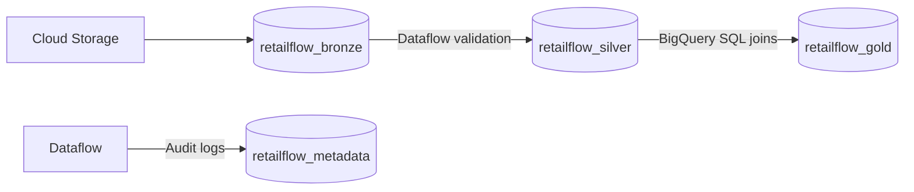

# BigQuery Module

This Terraform module provisions the Google BigQuery datasets required by the Cloud-Native Medallion data platform.

---

## 📁 Medallion Architecture Flow

- **Bronze Dataset**: Staging area for raw payloads. Raw CSV text lines are loaded directly as strings alongside ingestion timestamp and source filename metadata.
- **Silver Dataset**: Canonical Data Model (CDM) layer. Contains schema-validated, normalized columns ready for analytical queries.
- **Gold Dataset**: Curated reporting layer. Organizes transactional records into fact tables linked to dimension tables using surrogate keys.
- **Metadata Dataset**: Support layer tracking run executions, watermark timestamps, and failure audits.

---

## ⚙️ Design Decisions & Constraints

- **Dataset ID Naming**: Conforms to BigQuery naming rules (letters, numbers, underscores only). Formatted as `retailflow_${var.environment}_${var.layer}`.
- **Co-Location Alignment**: All datasets **must reside in the same region** as Cloud Storage, Cloud Functions, and Dataflow (e.g. `us-central1`). This prevents inter-region data transfer latency and cross-region egress charges.
- **Expirations Policies**: Expired data properties are **not** defined at the dataset level. Table partition and storage expirations are defined on the individual staging tables when created to prevent accidental loss of static assets.
- **Deletion Protection**: Configure `delete_contents_on_destroy` parameter depending on target environment profiles:
  - **Development**: `true` (Enables clean local test teardowns).
  - **Staging**: Configurable.
  - **Production**: `false` (Blocks dropping tables via automated plans).

---

## 🔒 Intended Dataset Access Control Model

| Dataset | Access Permission | Intended IAM Identity |
|---|---|---|
| **Bronze** | Read / Write | Dataflow Worker Service Account |
| **Silver** | Read / Write | Dataflow Worker & Transformation Service Accounts |
| **Gold** | Read / Write | SQL Transformation Service Account |
| **Gold** | Read | Analytics Users, BI Tool Service Accounts (e.g., Looker) |
| **Metadata** | Read / Write | Cloud Functions, Dataflow Worker Service Accounts |

---

## 📄 Planned Tables List

- **`retailflow_metadata` Dataset**:
  - `etl_watermark`: Tracks file names, process status, and SHA-256 hashes.
  - `etl_audit_log`: Logs stage timings, row counts, errors, and timeline events.
  - `pipeline_runs`: Summary execution durations.
  - `pipeline_errors`: Raw validation scorecards and trace details.

---

## 🛣️ Future Evolution Roadmap

The following enterprise capabilities are deferred to Milestone 2 and v3:
- **Authorized Views**: Restrict access to raw Silver tables by exposing only aggregated Gold views to reporting users.
- **Materialized Views**: Speed up common dashboard aggregations.
- **Data Policies (Column-Level Security)**: Mask sensitive columns (e.g. customer emails, phone numbers) using BigQuery Policy Tags.
- **Row-Level Security**: Filter transaction reporting access by region or store location permissions.

---

## Inputs

| Name | Type | Default | Description |
|---|---|---|---|
| `project_id` | `string` | Required | Target GCP Project ID. |
| `region` | `string` | Required | Target GCP region for BigQuery dataset storage. |
| `environment` | `string` | Required | Environment label (`dev`, `staging`, `prod`). |
| `delete_contents_on_destroy` | `bool` | `true` | If true, delete tables when destroying dataset resource. |
| `owner` | `string` | `"unknown"` | Responsible engineering team or cost owner. |
| `data_classification` | `string` | `"internal"` | Security classification label for dataset data. |
| `common_labels` | `map(string)` | `{}` | Key-value pairs for metadata labeling. |

---

## Outputs

| Name | Type | Description |
|---|---|---|
| `bronze_dataset_id` | `string` | The ID of the Bronze dataset. |
| `silver_dataset_id` | `string` | The ID of the Silver dataset. |
| `gold_dataset_id` | `string` | The ID of the Gold dataset. |
| `metadata_dataset_id` | `string` | The ID of the Metadata dataset. |
