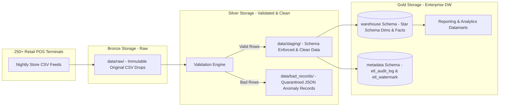

# System Architecture Specification

## Executive Summary
RetailFlow ETL is designed as an enterprise-grade batch data processing framework. While the pipeline loads data into a PostgreSQL Star Schema data warehouse, its internal staging lifecycle maps directly to the modern **Medallion Architecture (Bronze → Silver → Gold)**.

---

## Medallion Architecture Mapping

### 1. Bronze Layer (`data/raw/`)
- **Nature**: Raw, immutable store CSV exports dropped nightly into landing directories.
- **Purpose**: Preserves exact source data payloads for lineage auditing, re-ingestion, and disaster recovery.

### 2. Silver Layer (`data/staging/` & `data/bad_records/`)
- **Nature**: Conformed, cleaned, and validated data.
- **Purpose**: Schema enforcement, type coercion, null checks, business rule validation, and deduplication occur here. Invalid records are isolated in `data/bad_records/` with JSON failure diagnostic metadata.

### 3. Gold Layer (`warehouse` & `metadata` Schemas)
- **Nature**: Business-ready dimensional data model (Star Schema).
- **Purpose**: Optimized for high-speed analytical querying, BI dashboarding, and operational executive reporting.

---

## Why Use Star Schema with Medallion Architecture Concepts?
In modern enterprise data platforms, Medallion Architecture provides the **data hygiene lifecycle** (raw ingestion -> cleansing -> curated storage), while Kimball Star Schema provides the **analytical query interface** (fast JOINs, surrogate keys, business dimensional slices).

Combining both approaches delivers:
1. **Auditable Lineage**: Complete traceability from raw CSV (Bronze) to clean data (Silver) to dimensional warehouse (Gold).
2. **High-Performance Analytics**: Business intelligence tools (Tableau, PowerBI, SQL queries) perform significantly faster against Gold Star Schema tables than unstructured Lakehouse tables.
