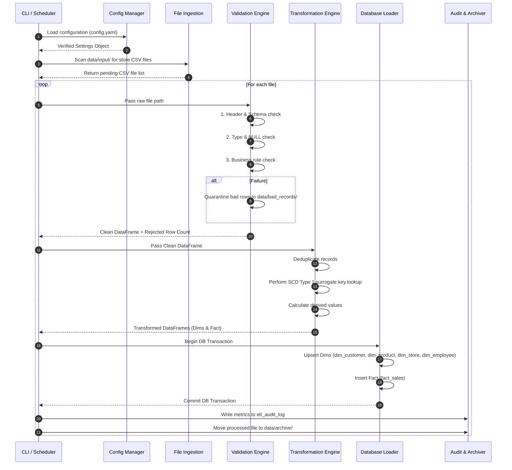

# Pipeline Execution Flow

## Execution Lifecycle

The RetailFlow ETL pipeline runs through 7 discrete execution stages:

---

## Stage Descriptions

1. **Initialization Stage**:
   - Parses command-line arguments and loads the active environment YAML configuration.
   - Instantiates centralized logging handlers and verifies PostgreSQL connectivity.

2. **Ingestion Stage**:
   - Discovers CSV files in `data/input/`.
   - Computes SHA-256 file hashes and queries `etl_audit_log` to detect previously ingested batches.

3. **Validation Stage**:
   - Validates column layout against expected schema signatures.
   - Enforces data type coercion rules (e.g., ISO dates, decimal monetary fields).
   - Filters out rows violating domain rules (negative quantities, invalid emails, future transaction timestamps).
   - Writes invalid rows with explicit error codes into `data/bad_records/{filename}_bad_{timestamp}.json`.

4. **Transformation Stage**:
   - Trims whitespace and normalizes string casing.
   - Applies SCD Type 1 updates to dimension entities.
   - Maps natural business keys (e.g., `store_id`, `product_id`) to internal warehouse surrogate keys (`store_sk`, `product_sk`).

5. **Loading Stage**:
   - Opens a PostgreSQL transaction.
   - Executes upserts (`INSERT ... ON CONFLICT DO UPDATE`) for dimension tables.
   - Performs batch inserts into `fact_sales`.

6. **Audit & Archival Stage**:
   - Calculates total execution duration, row counts read, loaded, and rejected.
   - Writes audit record to `etl_audit_log`.
   - Relocates processed CSV file from `data/input/` to `data/archive/YYYY/MM/DD/`.
