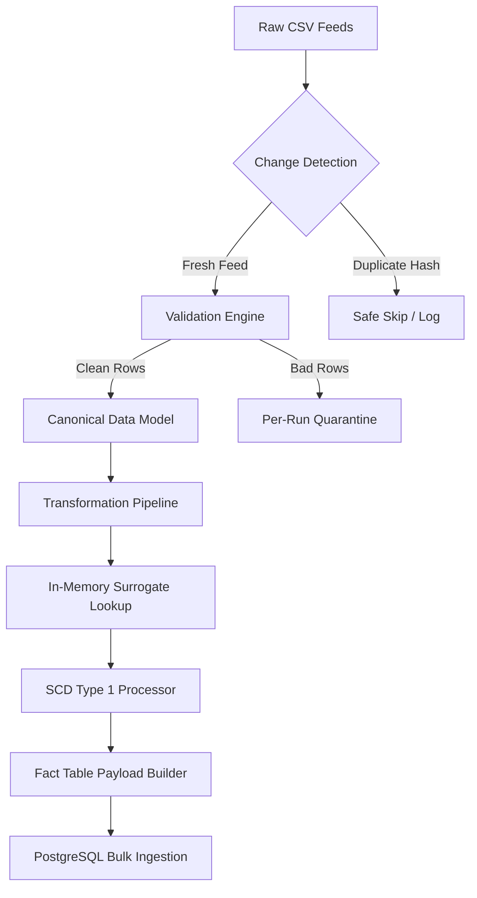

# RetailFlow ETL - Architectural Design Review

## Executive Summary
RetailFlow ETL is an enterprise-grade sales data warehouse pipeline designed for high-reliability Point-of-Sale (POS) batch processing across 250+ retail store locations. The system processes nightly store feed exports, enforces data quality thresholds, normalizes raw transactions into a Canonical Data Model, resolves surrogate keys via in-memory caching, and bulk loads a PostgreSQL Star Schema warehouse within atomic transaction boundaries.

---

## Key Architectural Decisions & Design Trade-offs

### 1. In-Memory Surrogate Key Resolution vs Database Lookups
- **Decision**: Pre-load dimension natural keys into dictionary lookup caches (`StoreCache`, `ProductCache`, `CustomerCache`, `EmployeeCache`).
- **Trade-off**: Increases RAM allocation by ~50 MB per 100k records, but reduces database query latency from O(N SQL queries) to O(1) in-memory hash map lookups.

### 2. Single-Transaction Warehouse Ingestion Scope
- **Decision**: Wrap dimension upserts, fact bulk inserts, file hash registration, and audit table logging inside a single `BEGIN ... COMMIT` block.
- **Trade-off**: Requires holding write locks on target tables for the duration of the batch load, but guarantees 100% all-or-nothing atomicity and eliminates partial data corruption.

---

## Production & Scalability Considerations
- **PySpark Transition Path**: The modular separation of `cleaner`, `normalizer`, `enricher`, and `surrogate_keys` allows replacing Pandas transformations with PySpark DataFrames for multi-terabyte feeds without altering downstream database loaders or audit logging.
- **Airflow / Dagster Orchestration**: The pipeline exposes clean CLI exit codes (`0` through `6`), making it trivial to trigger via Airflow `BashOperator` or `DockerOperator`.
