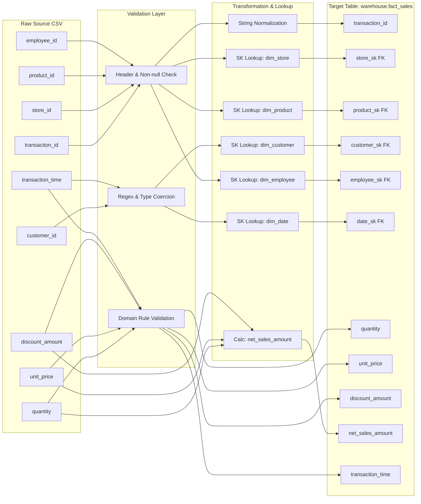

# Data Lineage & Mapping Specification

## Overview
This document traces the complete end-to-end data lineage of every field from raw source CSV exports (`data/raw/`) through validation, cleaning, surrogate key resolution, and final persistence into `warehouse` and `metadata` tables.

---

## 1. Sales Transaction Lineage (`store_{store_id}_sales_{YYYYMMDD}.csv`)

---

## 2. Field-by-Field Column Mapping Matrix

| Source File | Source Column | Transformation Rule | Target Schema.Table | Target Column | Target Data Type |
|---|---|---|---|---|---|
| `sales.csv` | `transaction_id` | Trim whitespace | `warehouse.fact_sales` | `transaction_id` | `VARCHAR(100)` |
| `sales.csv` | `store_id` | Dimension lookup on `dim_store.store_id` | `warehouse.fact_sales` | `store_sk` | `BIGINT` |
| `sales.csv` | `product_id` | Dimension lookup on `dim_product.product_id` | `warehouse.fact_sales` | `product_sk` | `BIGINT` |
| `sales.csv` | `customer_id` | Dimension lookup on `dim_customer.customer_id` (NULL if blank) | `warehouse.fact_sales` | `customer_sk` | `BIGINT` |
| `sales.csv` | `employee_id` | Dimension lookup on `dim_employee.employee_id` | `warehouse.fact_sales` | `employee_sk` | `BIGINT` |
| `sales.csv` | `transaction_time` | Format to `YYYYMMDD` integer for `dim_date.date_sk` lookup | `warehouse.fact_sales` | `date_sk` | `INT` |
| `sales.csv` | `quantity` | Coerce to `INT`, reject if `<= 0` | `warehouse.fact_sales` | `quantity` | `INT` |
| `sales.csv` | `unit_price` | Coerce to `NUMERIC(10,2)`, reject if `< 0.00` | `warehouse.fact_sales` | `unit_price` | `NUMERIC(10,2)` |
| `sales.csv` | `discount_amount` | Default `0.00` if empty | `warehouse.fact_sales` | `discount_amount` | `NUMERIC(10,2)` |
| Derived | N/A | `(quantity * unit_price) - discount_amount` | `warehouse.fact_sales` | `net_sales_amount` | `NUMERIC(12,2)` |
