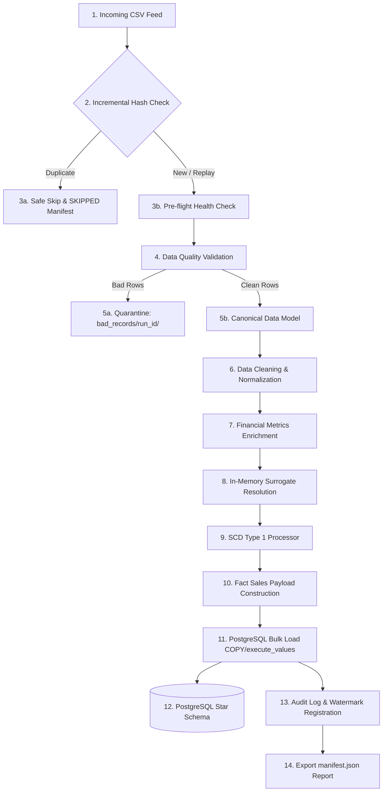

# Chapter 2: Complete Pipeline Overview

## 1. What Problem Does This Solve?
Understanding how a data engineering pipeline operates requires tracing a single piece of data from the moment it enters the system until it rests securely in the warehouse.

Without a structured lifecycle, pipelines suffer from unhandled errors, orphan database records, un-audited data loss, and non-repeatable executions.

---

## 2. Why Do We Need It?
An enterprise pipeline must operate like an assembly line in a factory. Each stage has a single, well-defined responsibility:
1. If a stage fails, the factory halts safely.
2. If malformed materials arrive, they are set aside without breaking the machines.
3. Every finished product is counted and inspected before leaving the factory.

---

## 3. How Our Implementation Works

### Stage-by-Stage Breakdown

#### Stage 1: File Arrival (`data/raw/`)
The pipeline detects a raw feed file (e.g., `sales_20260724.csv`).

#### Stage 2: Incremental Evaluation & Hash Check
`IncrementalEngine` calculates the file's SHA-256 content hash and queries `metadata.etl_watermark`.
- If the hash exists with status `SUCCESS` and `--replay` is NOT set, the file is classified as `DUPLICATE` and safely skipped.

#### Stage 3: Pre-Flight Health Checks
`HealthChecker` verifies database connectivity, configuration validity, directory write permissions, and available disk space (> 500 MB).

#### Stage 4: Data Quality Validation
`ValidationEngine` runs modular checks (`FileValidator`, `SchemaValidator`, `DataTypeValidator`, `BusinessRuleValidator`, `DuplicateValidator`).

#### Stage 5: Quarantine & CDM Instantiation
- Invalid rows are quarantined to `data/bad_records/<run_id>/invalid_rows.csv`.
- Valid rows are instantiated into Canonical Data Models (`CanonicalSale`).

#### Stage 6: Cleaning & Normalization
`clean_dataframe()` trims whitespace and standardizes NULLs. `normalize_dataframe()` lowercases emails and uppercases business codes.

#### Stage 7: Financial Enrichment
`enrich_sales_dataframe()` calculates `gross_sales_amount`, `net_sales_amount`, `discount_percentage`, and `effective_unit_price`.

#### Stage 8: Surrogate Key Resolution
`SurrogateKeyResolver` maps natural business keys (`STR-001`, `PROD-001`) to warehouse surrogate keys (`store_sk=1`, `product_sk=42`) using in-memory dictionary caches.

#### Stage 9: SCD Type 1 Processing
`SCD1Processor` compares incoming dimension attributes against target dimension tables to isolate new inserts vs updated records.

#### Stage 10: Fact Table Payload Construction
`build_fact_sales_payload()` constructs the final `fact_sales` DataFrame populated with surrogate keys and `audit_run_id`.

#### Stage 11 & 12: Bulk Ingestion into PostgreSQL
`WarehouseLoaderEngine` executes bulk insertion (`COPY` or `execute_values`) inside a single atomic transaction scope (`BEGIN ... COMMIT`).

#### Stage 13 & 14: Audit & Manifest Export
The pipeline updates `metadata.etl_watermark`, writes `metadata.etl_audit_log`, and exports `data/processed/<run_id>/manifest.json`.

---

## 4. How to Explain This in an Interview

> *"Our pipeline follows a 7-step execution sequence: Incremental change detection via SHA-256 hashing -> Pre-flight health checks -> Modular validation with per-run quarantine -> Canonical model normalization -> In-memory surrogate key resolution -> Atomic bulk ingestion into PostgreSQL -> Manifest export and audit logging."*
