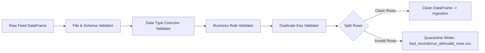

# Chapter 5: Data Quality Validation Engine

## 1. What Problem Does This Solve?
"Garbage in, garbage out." If a store cash register exports a CSV file with negative prices (`unit_price = -149.99`), future timestamps (`2099-01-01`), or corrupted row headers, loading that data directly into a warehouse corrupts financial reporting and breaks SQL queries.

Stopping the entire pipeline for a single bad row wastes time, while silently loading bad data ruins data integrity.

---

## 2. Why Do We Need It?
We need a modular Data Quality Layer that:
1. Validates incoming feeds against strict rules using vectorized execution.
2. Separates clean rows from invalid rows.
3. Quarantines bad records per run (`data/bad_records/<run_id>/invalid_rows.csv`) with full error diagnostics.
4. Allows clean rows to proceed through the pipeline if the failure rate is within tolerance (`max_error_percentage: 5.0`).

---

## 3. How Our Implementation Works

### Concrete CSV Examples

#### Input CSV Feed
```csv
transaction_id,store_id,product_id,employee_id,quantity,unit_price,transaction_time
TX-001,STR-001,PROD-001,EMP-001,2,49.99,2026-01-15 10:00:00   <-- GOOD ROW
TX-002,STR-001,PROD-002,EMP-001,-5,49.99,2026-01-15 10:05:00  <-- BAD ROW (Negative Quantity)
TX-003,STR-002,PROD-003,EMP-002,1,-149.99,2026-01-15 10:10:00 <-- BAD ROW (Negative Price)
TX-004,STR-002,PROD-001,EMP-002,1,49.99,2099-01-15 10:15:00   <-- BAD ROW (Future Date)
TX-001,STR-001,PROD-001,EMP-001,2,49.99,2026-01-15 10:00:00   <-- DUPLICATE ROW
```

### Modular Validator Suite (`src/retailflow/validation/validators.py`)



1. **FileValidator**: Verifies file existence, non-zero file size, and readable CSV structure.
2. **SchemaValidator**: Verifies required header columns exist (`transaction_id`, `store_id`, `product_id`, `quantity`, `unit_price`, `transaction_time`).
3. **DataTypeValidator**: Coerces numeric and datetime columns (`quantity` -> int, `unit_price` -> Decimal, `transaction_time` -> datetime). Catches string text in numeric fields (`quantity = "FIVE"`).
4. **BusinessRuleValidator**:
   - `quantity > 0`: Catches negative or zero quantity returns.
   - `unit_price >= 0.00`: Catches negative unit prices.
   - `transaction_time <= current_utc_timestamp`: Catches future timestamps.
5. **DuplicateValidator**: Checks primary key uniqueness (`df.duplicated(subset=['transaction_id'])`).

---

## 4. How to Explain This in an Interview

> *"Our Data Quality Engine executes 5 vectorized validation passes (File, Schema, DataType, Business Rules, and Duplicate Key detection). Instead of aborting the pipeline on a single error, bad records are partitioned into a per-run quarantine directory (`data/bad_records/<run_id>/`) with an error report, while clean records proceed to transformation."*
