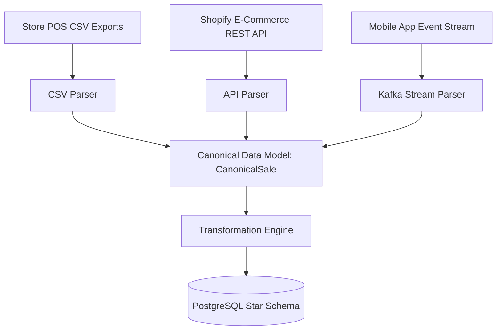

# Chapter 6: Canonical Data Model (CDM)

## 1. What Problem Does This Solve?
In enterprise environments, companies acquire new POS vendors, integrate e-commerce REST APIs, or ingest mobile app streaming feeds. If your pipeline transformations are tightly coupled to raw CSV column names (e.g., `df['unit_price']` or `df['tx_time']`), introducing a new source format requires rewriting every transformation script in your pipeline.

---

## 2. Why Do We Need It?
The **Canonical Data Model (CDM)** is a fundamental enterprise integration pattern. It acts as an abstraction layer between source systems and the data warehouse:



By normalizing all incoming source data into standardized **Canonical Entities** (`CanonicalSale`, `CanonicalCustomer`, `CanonicalProduct`, `CanonicalStore`), downstream transformations and warehouse loaders rely on a single canonical representation regardless of where the data originated.

---

## 3. How Our Implementation Works (`src/retailflow/models/canonical.py`)

We use **Pydantic v2** BaseModel schemas to define canonical entities:

```python
class CanonicalSale(BaseModel):
    """Canonical representation of a Point-of-Sale line-item transaction."""

    model_config = ConfigDict(str_strip_whitespace=True)

    transaction_id: str = Field(..., min_length=1)
    store_id: str = Field(..., min_length=1)
    product_id: str = Field(..., min_length=1)
    customer_id: Optional[str] = None
    employee_id: str = Field(..., min_length=1)
    quantity: int = Field(..., gt=0)
    unit_price: Decimal = Field(..., ge=Decimal("0.00"))
    discount_amount: Decimal = Field(default=Decimal("0.00"), ge=Decimal("0.00"))
    transaction_time: datetime
```

### Key CDM Architectural Benefits
1. **Type Safety & Automatic Coercion**: Pydantic validates datatypes, trims string whitespace, and converts string timestamps (`"2026-01-15 10:00:00"`) into Python `datetime` objects.
2. **Field Defaulting**: Missing optional fields (e.g. missing `customer_id` or `discount_amount`) automatically default to safe representations (`None` or `Decimal("0.00")`).

---

## 4. How to Explain This in an Interview

> *"We implement a Canonical Data Model using Pydantic schemas to decouple upstream ingestion formats from downstream warehouse logic. The CDM provides type enforcement, automatic field coercion, and ensures that adding a new source system (such as an e-commerce API or Kafka stream) only requires adding a parser to the CDM layer without modifying transformation code."*
