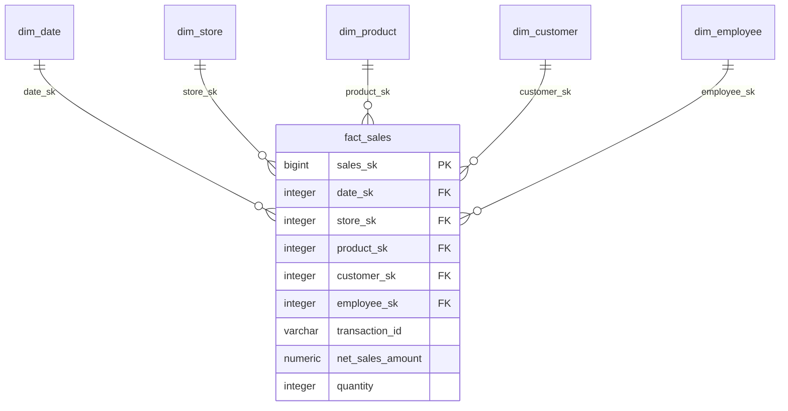

# Chapter 8: Data Warehouse & Star Schema Design

## 1. What Problem Does This Solve?
Storing sales data in a normalized transactional database (3NF) requires Joining 8 to 10 tables (`orders`, `order_items`, `customers`, `products`, `stores`, `employees`, `regions`, `promotions`) every time an analyst runs a monthly revenue report. At scale (millions of rows), multi-table JOINs stall reports and lock database resources.

---

## 2. Why Do We Need It?
A **Dimensional Star Schema** simplifies database queries by organizing data into two distinct types of tables:
1. **Fact Tables**: Central tables storing quantitative numeric measurements (e.g. `quantity`, `unit_price`, `net_sales_amount`) and foreign keys.
2. **Dimension Tables**: Surrounding context tables storing descriptive text attributes used for filtering and grouping (e.g. `store_name`, `region`, `category`, `customer_name`).



---

## 3. How Our Implementation Works

### 1. Primary Keys vs Surrogate Keys vs Business Keys
- **Natural Business Key**: The store/system identifier (e.g. `STR-EAST-001`). Can change during system re-platforming or store acquisitions.
- **Surrogate Key**: An auto-incrementing integer created by the data warehouse (e.g. `store_sk BIGINT GENERATED ALWAYS AS IDENTITY`). Surrogate keys protect the warehouse from external key changes and optimize SQL JOINs.

### 2. Range Partitioning on `fact_sales`
`warehouse.fact_sales` is range-partitioned by month on `transaction_time`:
```sql
CREATE TABLE warehouse.fact_sales (
    sales_sk BIGINT GENERATED ALWAYS AS IDENTITY,
    transaction_time TIMESTAMP WITH TIME ZONE NOT NULL,
    ...
) PARTITION BY RANGE (transaction_time);
```
Querying data for July 2026 allows PostgreSQL to execute **partition pruning**—reading only the `fact_sales_y2026m07` partition file on disk while ignoring all other months.

### 3. Slowly Changing Dimensions (SCD Type 1 vs Type 2)
- **SCD Type 1 (Chosen Approach)**: Overwrites old dimension attribute values with new values.
  - *Example*: If Store #001 changes its `region` from `"North"` to `"Northeast"`, the existing row in `dim_store` is updated in-place.
  - *Why Type 1?*: For retail store master metadata, current state reporting was required. Type 1 simplifies schema maintenance and storage overhead compared to tracking historical versions in Type 2.

---

## 4. How to Explain This in an Interview

> *"We implemented a dimensional Star Schema in PostgreSQL featuring `dim_date`, `dim_customer`, `dim_product`, `dim_store`, `dim_employee`, and a central `fact_sales` table range-partitioned monthly. We use integer surrogate keys to decouple the warehouse from source natural key changes, and enforce SCD Type 1 for dimension updates to support current-state reporting."*
