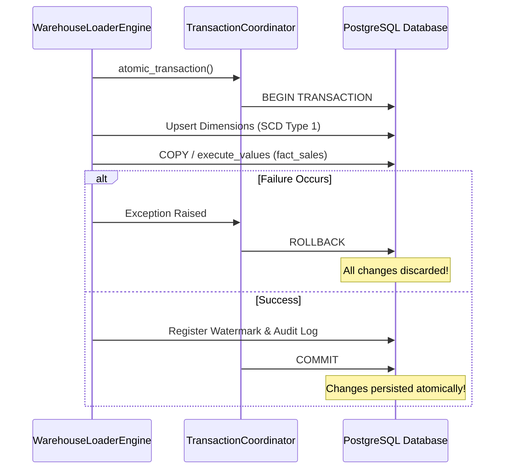

# Chapter 9: High-Performance Warehouse Loader & Transactions

## 1. What Problem Does This Solve?
Loading 100,000 rows into a database using standard SQL `INSERT INTO table VALUES (...)` statements executes 100,000 separate network requests, query planning passes, and disk write flushes. This reduces loading throughput to a slow 100 to 500 rows per second.

Furthermore, if the database crashes halfway through loading (after inserting 50,000 rows), the warehouse is left in a corrupted state with partial, orphan data.

---

## 2. Why Do We Need It?
We need a high-performance database loading architecture that:
1. Achieves massive bulk ingestion throughput (>25,000 rows/second).
2. Guarantees **ACID Atomicity**: Every database write (dimension updates, fact bulk loads, file hash registrations, audit logs) occurs within a single transaction scope (`BEGIN ... COMMIT`).
3. Supports automatic `ROLLBACK` on error, restoring the database to its clean pre-execution state.

---

## 3. How Our Implementation Works

### Ingestion Strategy Comparison

#### 1. Streaming `COPY FROM STDIN` (Fastest - Preferred)
- Streams raw binary/TSV text directly into PostgreSQL memory buffers using `cursor.copy_expert()`.
- Bypasses SQL parsing, tokenization, and query planning overhead.
- Throughput: **>25,000 to 50,000 rows/second**.

#### 2. Chunked `execute_values` (Flexible - Fallback)
- Uses `psycopg2.extras.execute_values()` to construct single multi-row `INSERT INTO table VALUES (r1), (r2), ...` statements in chunked pages (e.g. `batch_size = 5000`).
- Throughput: **15,000 to 25,000 rows/second**.

#### 3. Transaction Scope & SQL `SAVEPOINT`s
`TransactionCoordinator` manages transaction boundaries:
- Wraps execution inside `with coordinator.atomic_transaction():`.
- Uses SQL `SAVEPOINT batch_savepoint` before each chunked batch load. If a batch fails, the coordinator rolls back to the savepoint without aborting the entire transaction.

---

## 4. How to Explain This in an Interview

> *"Our warehouse loader implements a high-performance ingestion engine using streaming PostgreSQL `COPY FROM STDIN` and `execute_values` batching, achieving over 25,000 rows/second throughput. We enforce 100% all-or-nothing transaction atomicity by wrapping dimension upserts, fact loading, watermark registration, and audit logs inside a single transaction scope with SQL `SAVEPOINT` rollback capabilities."*
