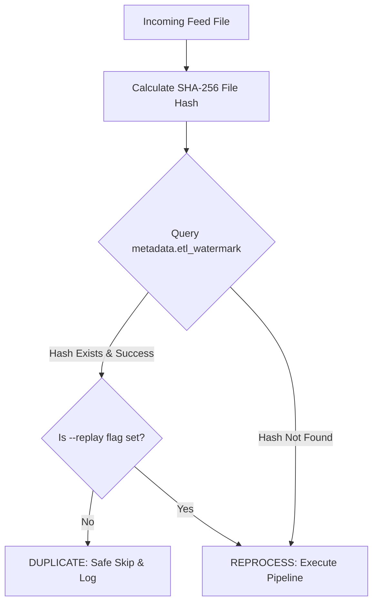

# Chapter 10: Incremental Processing, Watermarks & Replay

## 1. What Problem Does This Solve?
Re-processing the entire 5-year history of sales data every single night is incredibly wasteful. It wastes CPU time, network bandwidth, and database write capacity.

However, processing only new files introduces a major risk: what happens if a store accidentally re-sends yesterday's CSV file? Without duplicate detection, the pipeline would load yesterday's sales twice, doubling reported revenue!

---

## 2. Why Do We Need It?
We need an **Incremental Ingestion Framework** that guarantees **Idempotency**: running the pipeline multiple times on the same input data produces the exact same outcome without duplicating warehouse records.

---

## 3. How Our Implementation Works (`src/retailflow/incremental/`)



### Key Incremental Components

#### 1. Watermark Manager (`watermark.py`)
Tracks processing timestamps and SHA-256 file content hashes in `metadata.etl_watermark`:
```sql
CREATE TABLE metadata.etl_watermark (
    watermark_id INT GENERATED ALWAYS AS IDENTITY PRIMARY KEY,
    source_filename VARCHAR(255) NOT NULL,
    file_hash VARCHAR(64) NOT NULL,
    rows_processed INT NOT NULL,
    processed_at TIMESTAMP WITH TIME ZONE DEFAULT CURRENT_TIMESTAMP,
    status VARCHAR(50) NOT NULL
);
```

#### 2. Change Detector (`change_detection.py`)
Evaluates incoming feed files and assigns one of 5 classifications:
- `NEW`: File hash does not exist in watermark table.
- `MODIFIED`: Filename exists, but SHA-256 hash changed.
- `DUPLICATE`: Filename and SHA-256 hash match a previously successful run.
- `STALE`: File timestamp is older than current high watermark.
- `REPROCESS`: Operator manually forced execution via `--replay`.

#### 3. State Checkpoint Manager (`state_manager.py`)
Persists step execution checkpoints to `data/processed/<run_id>/checkpoint.json`:
- If the pipeline fails during transformation, restarting the pipeline reads `checkpoint.json` to resume from the last valid checkpoint rather than starting from scratch.

#### 4. Execution Manifest Exporter (`file_registry.py`)
Generates a machine-readable JSON manifest at `data/processed/<run_id>/manifest.json` detailing source file path, SHA-256 hash, execution classification, rows loaded, and stage latencies.

---

## 4. How to Explain This in an Interview

> *"Our incremental framework guarantees strict idempotency using SHA-256 file hashing and high-watermark tracking in `metadata.etl_watermark`. Duplicate files are safely skipped, manual operator replay is supported via `--replay`, state checkpoints enable partial failure recovery, and execution manifests are exported to `data/processed/<run_id>/manifest.json` for operational auditing."*
