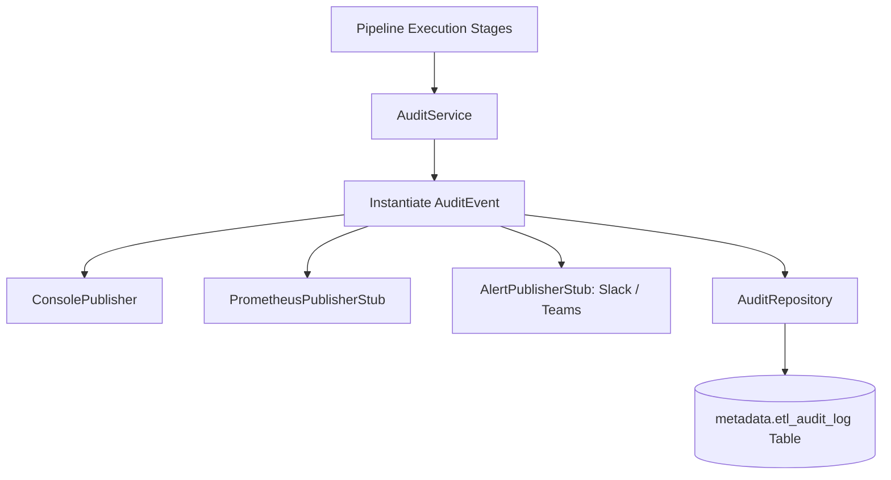

# Chapter 11: Operational Audit & Observability System

## 1. What Problem Does This Solve?
Standard text log files (like `app.log`) are great for developer debugging, but terrible for operational monitoring. When an executive or operations team asks:
- *"Did the 2:00 AM batch load finish successfully?"*
- *"How many rows were rejected across all runs this week?"*

Parsing megabytes of raw text log files using `grep` is slow, un-queryable, and error-prone.

---

## 2. Why Do We Need It?
Enterprise data platforms require **Observability**: the ability to query operational metadata, track execution timelines, publish real-time telemetry metrics, and maintain immutable audit tables in SQL.

---

## 3. How Our Implementation Works (`src/retailflow/audit/`)

### Key Components of the Audit Subsystem

#### 1. Standardized Event Taxonomy (`models.py`)
Defines 12 `PipelineLifecycleEvent` lifecycle events:
- `PIPELINE_STARTED`, `HEALTH_CHECK_COMPLETED`, `VALIDATION_STARTED`, `VALIDATION_COMPLETED`, `TRANSFORMATION_STARTED`, `TRANSFORMATION_COMPLETED`, `LOADING_STARTED`, `LOADING_COMPLETED`, `WATERMARK_UPDATED`, `RECONCILIATION_COMPLETED`, `PIPELINE_COMPLETED`, `PIPELINE_FAILED`.

Also defines `AuditSeverity` (`INFO`, `WARNING`, `ERROR`, `CRITICAL`) and `FailureCategory` (`VALIDATION_ERROR`, `DATABASE_ERROR`, `CONFIG_ERROR`).

#### 2. Telemetry Publisher Extensions (`publisher.py`)
Implements an extensible `BaseAuditPublisher` interface:
- `ConsolePublisher`: Outputs structured JSON log records to stdout.
- `PrometheusPublisherStub`: Emits operational metrics (`pipeline_rows_loaded_total`, `stage_duration_seconds`).
- `AlertPublisherStub`: Dispatches real-time Slack/Teams alerts on pipeline failures.

#### 3. Audit Repository Search API (`repository.py`)
Persists and queries `metadata.etl_audit_log`. Provides clean Python search methods:
- `get_run(run_id)`
- `list_recent_runs(limit=10)`
- `get_failed_runs()`

---

## 4. How to Explain This in an Interview

> *"We built an operational audit subsystem decoupled from standard logging. It emits 12 lifecycle events stored in `metadata.etl_audit_log`, supports extensible telemetry publishers (Prometheus/Slack alert stubs), provides a search API (`AuditRepository`), and generates execution timelines for operational monitoring."*
