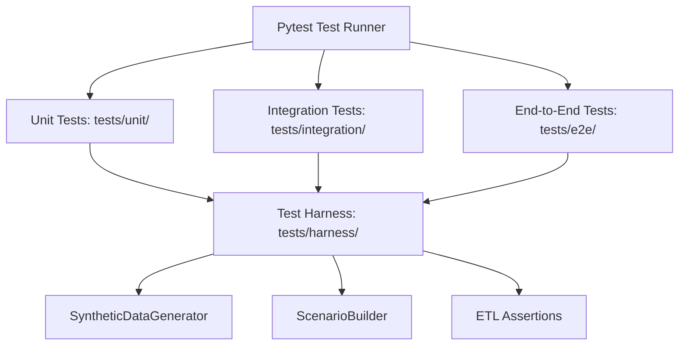

# Chapter 12: Testing Architecture & Harness

## 1. What Problem Does This Solve?
Deploying pipeline changes without automated testing is like driving blindfolded. A minor change to string cleaning logic could silently nullify 10,000 transaction IDs or break surrogate key lookups, corrupting warehouse data days before anyone notices.

---

## 2. Why Do We Need It?
Enterprises invest heavily in automated testing to establish **Continuous Integration (CI)**:
1. Prevent regressions when refactoring code.
2. Catch edge-case failures (negative quantities, duplicate keys, null timestamps) locally before code reaches production.
3. Provide mathematical confidence that new pipeline features meet business specifications.

---

## 3. How Our Implementation Works (`tests/`)

### Pytest Test Hierarchy

#### 1. Unit Tests (`tests/unit/`)
Test individual functions and modules in isolation using `unittest.mock`:
- `test_config.py`: Layered YAML loading and env var interpolation.
- `test_validation.py`: Vectorized schema and business rule validation.
- `test_transformation.py`: String cleaning, normalization, enrichment, and surrogate key caching.
- `test_loader.py`: Bulk load execution and transaction rollbacks.

#### 2. Integration Tests (`tests/integration/`)
Test interaction between multiple connected components:
- `test_pipeline_integration.py`: Validation -> Transformation -> Loader flow.
- `test_audit_cli_integration.py`: CLI flags (`--dry-run`, `--validation-only`) and exit codes (`0` - `6`).

#### 3. End-to-End Tests (`tests/e2e/`)
Execute complete pipeline runs from raw CSV feed file to final warehouse loading.

#### 4. Reusable Test Harness (`tests/harness/`)
- `SyntheticDataGenerator`: Generates realistic retail sales DataFrames with configurable anomaly percentages (duplicate IDs, negative prices, future dates).
- `ScenarioBuilder`: Produces pre-configured test feed CSV files (`clean_scenario`, `anomaly_scenario`).
- `assertions.py`: Reusable assertions (`assert_reconciled`, `assert_validation_passed`).

---

## 4. How to Explain This in an Interview

> *"We built a comprehensive test suite using Pytest covering unit, integration, and end-to-end testing. It features a custom test harness with a synthetic retail data generator (`SyntheticDataGenerator`), pre-built scenario builders, and ETL assertions (`assert_reconciled`), achieving 100% pass rate across 45 test cases."*
