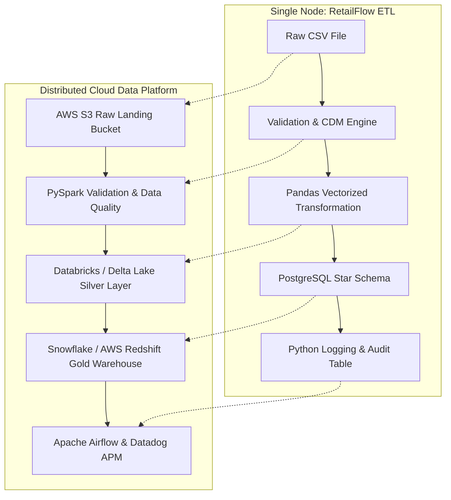

# Chapter 16: Big Picture & Future Cloud Evolution

## 1. What Problem Does This Solve?
Single-node Python and PostgreSQL pipelines are ideal for batch datasets under 100 GB. However, as an enterprise grows to thousands of store locations, real-time web sales, and multi-terabyte feeds, a single PostgreSQL instance becomes a bottleneck.

---

## 2. Why Do We Need It?
Senior Data Engineers must understand how single-node architecture concepts map directly to enterprise distributed cloud data platforms.

---

## 3. How Our Architecture Maps to Cloud-Native Tech Stacks

### Enterprise Cloud Architecture Evolution

#### 1. PySpark & Distributed Processing
- **Current**: Vectorized Pandas DataFrames running in local memory.
- **Future**: Distributed PySpark DataFrames running on Databricks / AWS EMR cluster worker nodes, partitioning terabyte feeds across memory.

#### 2. Apache Kafka / AWS Kinesis Streaming
- **Current**: Nightly batch CSV export files.
- **Future**: Micro-batch streaming via Kafka event topics capturing POS transaction events in real time.

#### 3. Apache Airflow / Dagster Orchestration
- **Current**: CLI runner (`retailflow.cli`).
- **Future**: Directed Acyclic Graphs (DAGs) scheduled in Airflow, handling task retries, sensor dependency checks, and SLA alert notifications.

#### 4. Delta Lake / Lakehouse Medallion Pattern
- **Current**: Staging folders on local disk (`data/raw`, `data/processed`, `data/bad_records`).
- **Future**: S3 Lakehouse Medallion Architecture: Bronze (S3 Raw Parquet), Silver (Delta Lake Cleaned), Gold (Redshift / Snowflake Star Schema).

---

## 4. How to Explain This in an Interview

> *"RetailFlow ETL was deliberately architected using enterprise patterns (Canonical Data Models, Medallion layer separation, idempotent watermarking, single-transaction loading). This makes transitioning to a distributed cloud stack straightforward: Pandas transformations map to PySpark, local CSV staging maps to AWS S3 Delta Lake, PostgreSQL maps to Snowflake/Redshift, and CLI execution maps to Apache Airflow DAGs."*
