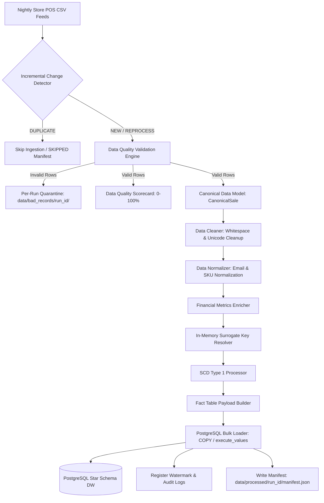
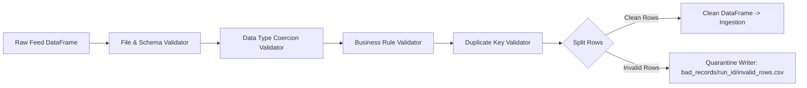
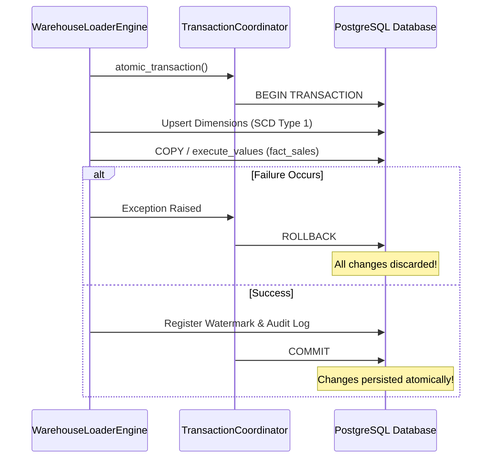
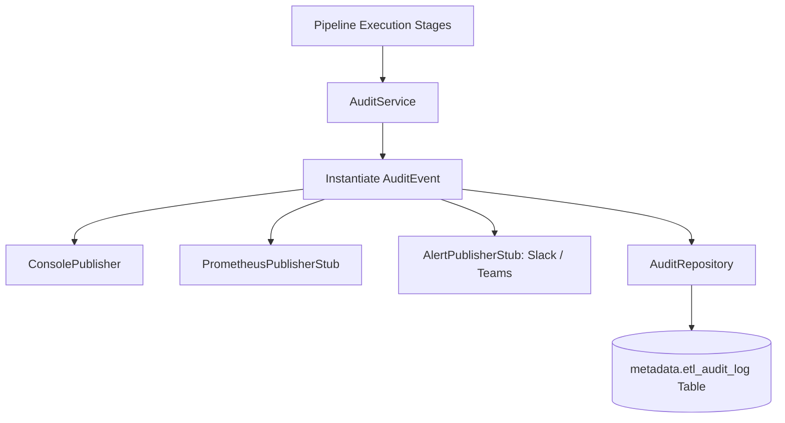
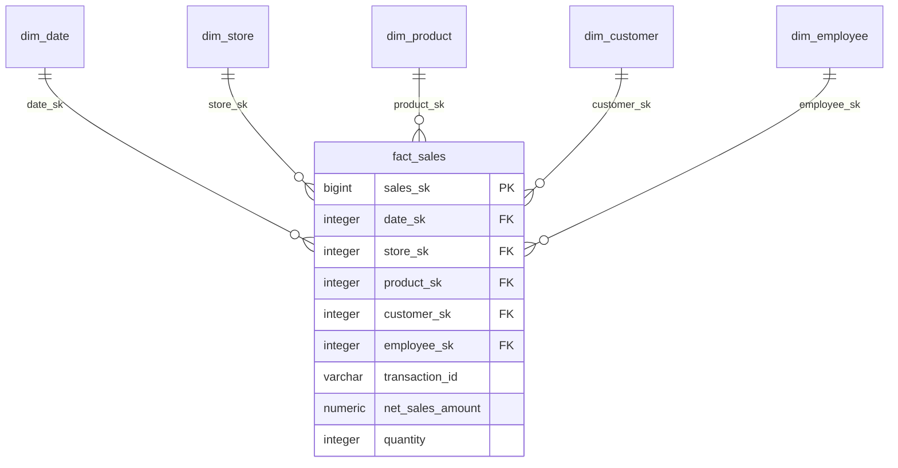

# Chapter 19: Visual Learning & System Architecture Diagrams

This chapter consolidates all architectural sequence and flow diagrams across RetailFlow ETL.

---

## 1. Overall System Architecture

---

## 2. Validation & Quarantine Subsystem

---

## 3. High-Performance Bulk Load Transaction Scope

---

## 4. Operational Telemetry & Audit Dispatch

---

## 5. Warehouse Star Schema ERD

