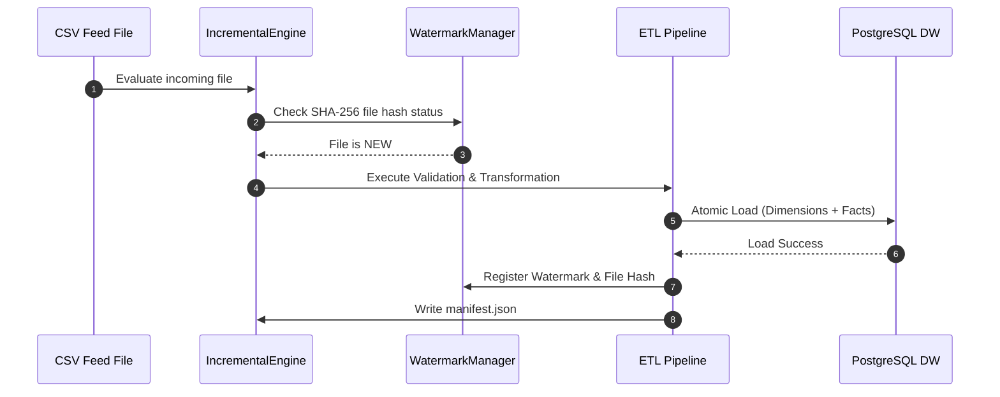
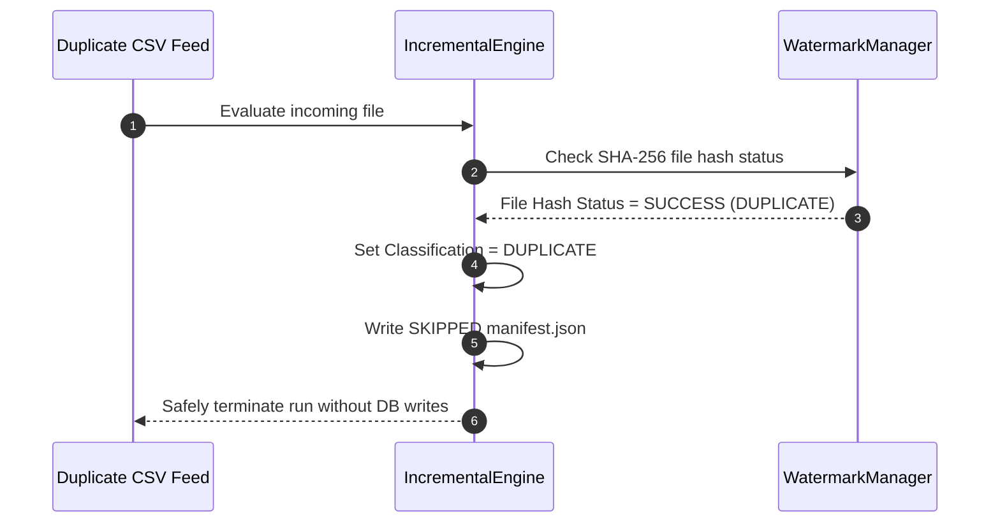
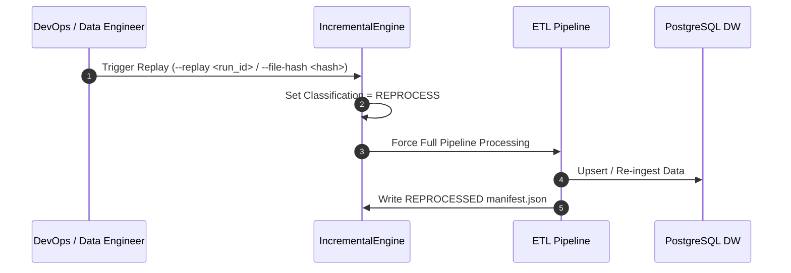
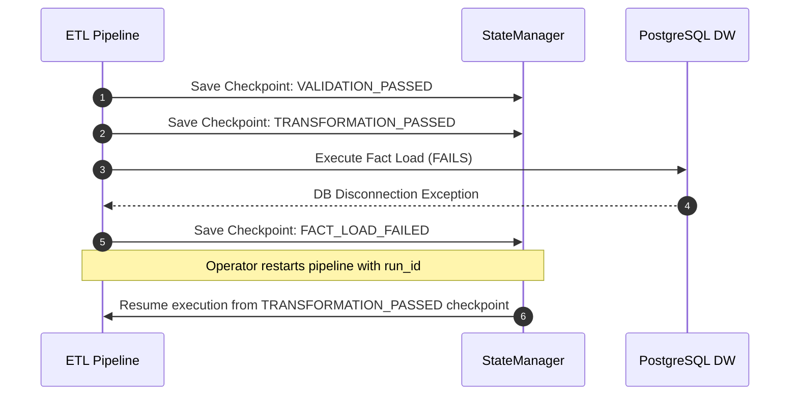

# Incremental Processing, Watermarking & Replay Engineering Guide

## Overview
This engineering runbook details the incremental processing subsystem of RetailFlow ETL. It explains change classification, high-watermark updates, manual replay protocols, state checkpoint recovery, and execution manifest auditing.

---

## 1. Execution Sequence Diagrams

### Normal Incremental Execution Flow

### Duplicate Detection & Safe Skip Flow

### Manual Replay Flow

### Partial Failure Checkpoint Recovery Flow

---

## 2. Change Classification Reference

| Classification | Trigger Condition | Pipeline Action |
|---|---|---|
| **`NEW`** | File SHA-256 hash missing from `metadata.etl_watermark` | Complete validation, transformation, and warehouse load |
| **`DUPLICATE`** | File SHA-256 hash already exists with status `SUCCESS` | Log warning, generate `SKIPPED` manifest, terminate cleanly |
| **`MODIFIED`** | Filename identical, but SHA-256 content hash changed | Process as fresh feed, update watermark |
| **`STALE`** | Feed file timestamp older than configured window | Ignore feed, log operational warning |
| **`REPROCESS`** | Operator explicitly supplied `--replay` flag | Override watermark check, re-run full pipeline |
