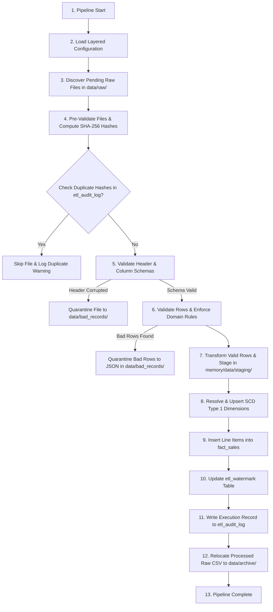

# Pipeline Execution Lifecycle Specification

## Overview
This document serves as the formal execution blueprint for the `retailflow.pipeline` orchestrator module. It defines the step-by-step state transitions for ingesting, validating, transforming, loading, and auditing nightly store batch exports.

---

## Complete Pipeline Execution Lifecycle

---

## Detailed Execution Steps

### 1. Pipeline Start & Initialization
- Command-line entry point (`retailflow.main`) triggers the pipeline orchestrator.
- Execution Run ID (`uuid4`) is generated and logged to track the entire process lifecycle.

### 2. Load Layered Configuration
- `retailflow.config` reads `config/base.yaml`, merges environment-specific overrides (`config/development.yaml` or `config/production.yaml`), and resolves environment variables (`POSTGRES_PASSWORD`).
- Instantiates Pydantic settings schema to validate host, port, directory targets, and execution parameters.

### 3. Discover Raw Files
- Scans `data/raw/` (or `--input-dir`) for matching feed files (`store_*_sales_*.csv`).
- Sorts discovered files by timestamp to ensure deterministic batch execution ordering.

### 4. File Pre-Validation & Idempotency Check
- Computes SHA-256 file checksum for each discovered CSV file.
- Queries `etl_audit_log` to verify if the file checksum was already successfully processed.
- If duplicate file hash is detected, logs warning, moves raw file to `data/archive/duplicates/`, and continues.

### 5. Validate Schema & Column Headers
- Loads file headers using lightweight line reading.
- Compares column list against defined source schema in `retailflow.models.schemas`.
- If mandatory columns are missing or file is corrupt, relocates the entire raw file to `data/bad_records/` with `.error` metadata log.

### 6. Validate Row Contents & Enforce Domain Rules
- Executes vectorized row quality checks using `retailflow.validation`:
  - Datatype coercion (ISO timestamps, float prices, int quantities).
  - Domain constraints (`quantity > 0`, `unit_price >= 0.00`, transaction timestamp not in future).
  - Primary key uniqueness check.
- Separates invalid rows into a bad record DataFrame and exports them to `data/bad_records/{filename}_bad_{timestamp}.json`.

### 7. Transform Valid Rows
- Executes business transformations in `retailflow.transformation`:
  - Trims whitespace and normalizes string fields.
  - Computes calculated fields: `net_sales_amount = (quantity * unit_price) - discount_amount`.
  - Stages cleaned DataFrame into `data/staging/` or in-memory batch state.

### 8. Resolve & Upsert Dimensions (SCD Type 1)
- Performs upserts (`INSERT ... ON CONFLICT (natural_key) DO UPDATE`) into `dim_customer`, `dim_product`, `dim_store`, and `dim_employee`.
- Resolves natural business keys to database surrogate keys (`customer_sk`, `product_sk`, `store_sk`, `employee_sk`).

### 9. Load Fact Records (`fact_sales`)
- Opens database transaction block (`BEGIN`).
- Performs bulk insert (`COPY` or batch `INSERT`) of transformed line items into `fact_sales`.
- Assigns foreign key surrogate keys and `audit_run_id`.

### 10. Update Watermark Tracking
- Updates `etl_watermark` table with store ID, maximum `transaction_time` ingested, and batch run timestamp.

### 11. Record Audit Metrics
- Writes pipeline run metrics into `etl_audit_log`:
  - Run ID, start time, end time, execution status (`SUCCESS` / `FAILED` / `PARTIAL_SUCCESS`).
  - Total rows read, loaded, rejected.
  - Duration in milliseconds.

### 12. Archive Processed Files
- Moves raw source CSV file from `data/raw/` into `data/archive/YYYY/MM/DD/` for audit compliance.

### 13. Pipeline Complete
- Closes database connection pool, flushes log handlers, and exits with status code 0.
