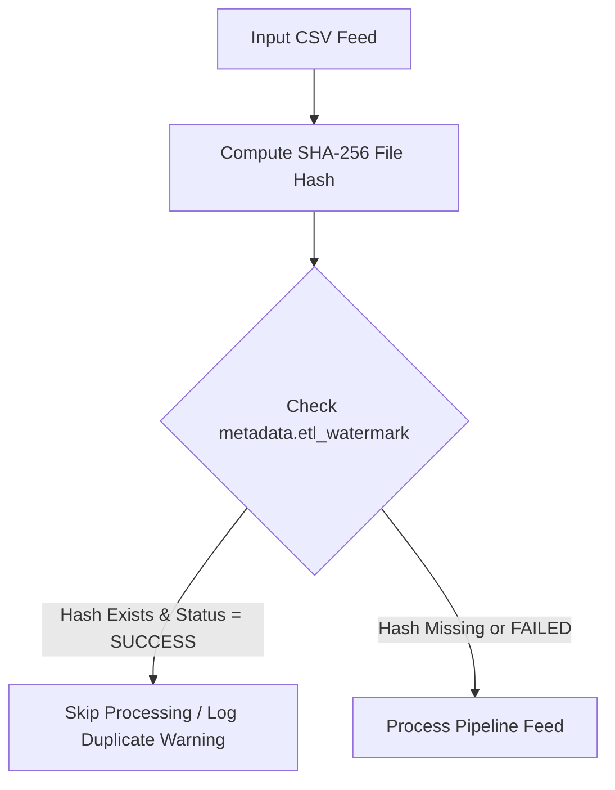

# Operational Failure Recovery & Idempotency Strategy

## Overview
This document details operational failure modes, transaction isolation, idempotency mechanisms, and watermark restoration protocols for RetailFlow ETL.

---

## 1. Idempotent Processing Guarantee
Reprocessing the same CSV feed file must never corrupt warehouse surrogate keys or create duplicate fact rows.

### Idempotency Flow

---

## 2. Recovery Scenarios

| Failure Scenario | Impact | Automatic Recovery Strategy |
|---|---|---|
| **Database Disconnection during Fact Load** | Partial batch write | Transaction coordinator rolls back `BEGIN` scope. Zero rows committed. |
| **Malformed Data Threshold Exceeded** | Bad records in feed | Quarantine writer extracts invalid rows to `data/bad_records/<run_id>/`. Feed cleanly aborted. |
| **Pipeline Interruption / Power Outage** | Uncommitted state | Watermark table is un-updated. Rerunning pipeline reads watermark, detects incomplete status, and safely reprocesses. |
