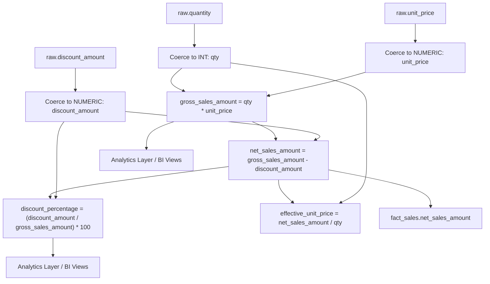
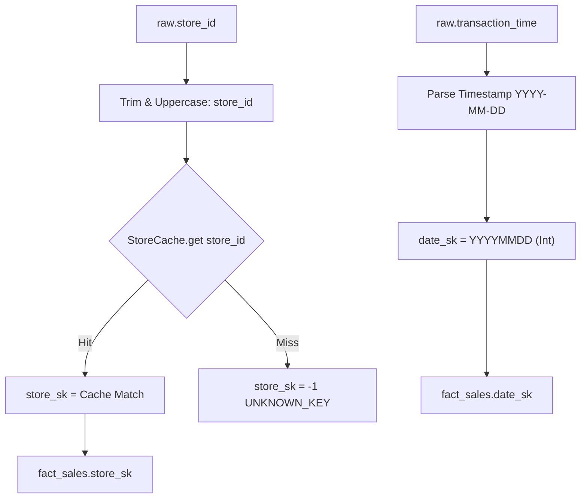

# Transformation Derivation Lineage

## Overview
This document illustrates how derived financial metrics and surrogate keys in `warehouse.fact_sales` are computed from raw input CSV fields.

---

## Metric Derivation Diagrams

### 1. Financial Metrics Derivation

### 2. Surrogate Key Resolution Lineage

