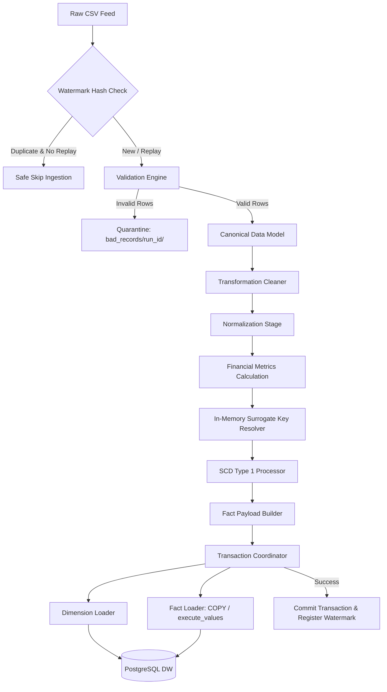
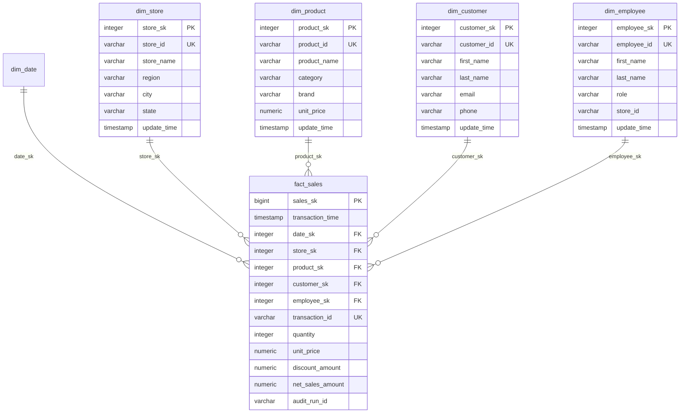

# RetailFlow ETL v1.0 — Comprehensive Engineering Audit & Technical Assessment

This document provides a detailed technical assessment and architectural audit of the RetailFlow ETL v1.0 codebase. It analyzes the current implementation state, execution flows, business logic, data models, technology stack, and extension points to prepare for the **RetailFlow ETL v2.0 - Google Cloud Modernization** initiative.

---

## 1. Repository Overview

### Complete Directory Tree
```text
retailflow-etl/
├── config/                  # Environment-specific YAML configuration profiles
│   ├── base.yaml            # Base default settings
│   ├── local.yaml           # Local override profile
│   ├── development.yaml     # Development override profile
│   ├── testing.yaml         # Unit/integration testing profile
│   ├── staging.yaml         # Staging override profile
│   ├── production.yaml      # Production override profile
│   └── benchmark.yaml       # Performance benchmarking profile
├── data/                    # Local storage staging lifecycle
│   ├── raw/                 # Input landing directory for raw CSV files
│   ├── staging/             # Temporary staging folder
│   ├── processed/           # Archive directory for completed run manifests
│   ├── archive/             # Directory for processed raw feeds
│   └── bad_records/         # Quarantine directory for rejected rows
├── docs/                    # Architectural decision records, guides, and handbook
│   ├── adr/                 # Architecture Decision Records (ADR-001 to ADR-007)
│   ├── handbook/            # Complete 21-Chapter Developer Handbook
│   ├── architecture_review.md
│   ├── incremental_loading.md
│   ├── operations_runbook.md
│   ├── postgresql_performance.md
│   ├── project_showcase.md
│   ├── recovery_strategy.md
│   └── resume_mapping.md
├── sample_data/             # Reusable sample datasets
│   ├── small/               # Clean 1,000-row sample datasets
│   ├── medium/              # 10,000-row sample datasets
│   ├── invalid/             # Corrupt/invalid row datasets
│   └── duplicates/          # Datasets containing duplicate transaction IDs
├── sql/                     # PostgreSQL DDL & DML scripts
│   ├── ddl/                 # Database schema DDL scripts (warehouse & metadata)
│   └── dml/                 # Seed data insertions and sample analysis queries
├── src/retailflow/          # Primary Python package code
│   ├── audit/               # Operational audit subsystem, timeline engine, publishers
│   ├── config/              # Layered YAML configuration loader & semantic validator
│   ├── constants/           # Global constants, error codes, stage enums
│   ├── database/            # Connection pool manager & transaction coordinator
│   ├── exceptions/          # Domain-specific exception hierarchy
│   ├── health/              # Pre-flight environment & dependency health checker
│   ├── incremental/         # Watermark manager, SHA-256 change detector, state checkpoints
│   ├── loader/              # Bulk COPY engine, dimension loader, fact loader, transactions
│   ├── metrics/             # Performance metrics collector & stage timer
│   ├── models/              # Canonical Data Model (CDM), validation & load DTOs
│   ├── pipeline/            # PipelineContext container & state context
│   ├── transformation/      # Cleaner, normalizer, enricher, surrogate resolver, SCD1
│   ├── utils/               # Structured JSON logger & sensitive data redactor
│   ├── validation/          # Data Quality validators & scorecard calculator
│   └── cli.py               # Operational Command-Line Interface runner
├── tests/                   # Complete unit, integration, and E2E test suites
│   ├── unit/                # Individual module unit tests
│   ├── integration/         # Inter-component integration tests
│   ├── e2e/                 # Full pipeline end-to-end scenarios
│   └── harness/             # Test harness generators, builders, and assertions
├── benchmarks/              # Performance throughput & memory profiling benchmarks
├── pyproject.toml           # Project metadata & linter configuration
├── requirements.txt         # Production dependency pins
└── README.md                # Open-source project entry point
```

### Major Module Purpose & Responsibilities

- **`src/retailflow/cli.py`**: Pipeline entry point. Parses CLI flags, setups logging, runs health checks, evaluates file watermarks, coordinates the pipeline stages, and translates python exceptions into standardized exit codes.
- **`src/retailflow/config/loader.py`**: Configuration parser. Resolves environment variable parameters and merges environment-specific overrides with `base.yaml`.
- **`src/retailflow/database/connection.py`**: Encapsulates `psycopg2.pool.ThreadedConnectionPool` with retry logic, randomized backoff jitter, and connections context manager.
- **`src/retailflow/validation/engine.py`**: Orchestrates vectorized Pandas validations and coordinates writing quarantined records to `data/bad_records/<run_id>/`.
- **`src/retailflow/models/canonical.py`**: Source-agnostic Pydantic v2 schemas representing the Canonical Data Model entities.
- **`src/retailflow/transformation/engine.py`**: Coordinates cleaning, case normalization, metric calculations, surrogate key mapping, and SCD Type 1 updates.
- **`src/retailflow/loader/engine.py`**: Manages dimension updates and transactional fact table insertions.
- **`src/retailflow/incremental/engine.py`**: Calculates file SHA-256 hashes, maintains high-watermark watermarks, checks for duplicates, and writes state checkpoints.
- **`src/retailflow/audit/engine.py`**: Manages logging events to `metadata.etl_audit_log`, formats run timelines, and manages consoles and alert publishers.

---

## 2. Current Execution Flow

The pipeline executes as a sequential synchronous process:

```text
[cli.py] --(Parse Args & Load Config)--> [config/loader.py]
   │
[cli.py] --(Execute Health Checks)--> [health/checker.py]
   │
[cli.py] --(Evaluate Watermarks & Hashes)--> [incremental/engine.py]
   │
   ├── (If DUPLICATE and --replay is False) -> [Exit CLI (Code 0)]
   │
[cli.py] --(Ingest & Validate CSV Feed)--> [validation/engine.py]
   │
   ├── (If invalid rows > threshold) -> [Exit CLI (Code 1 - Quarantine written)]
   │
[cli.py] --(Convert Clean Rows to CDM)--> [models/canonical.py]
   │
[cli.py] --(Run Vectorized Transformations)--> [transformation/engine.py]
   │
[cli.py] --(Execute Warehouse Ingestion)--> [loader/engine.py]
   │
   ├── [loader/dimension_loader.py] (SCD Type 1 Updates)
   ├── [loader/fact_loader.py] (Bulk Ingest via COPY / execute_values)
   └── [loader/transactional.py] (Atomic COMMIT / ROLLBACK)
   │
[cli.py] --(Register Watermark & Logging)--> [audit/engine.py]
   │
[cli.py] --(Export Run manifest.json)--> [Exit CLI (Code 0)]
```

### Flow and Component Interactions
- **CLI Initialization**: `cli.py` instantiates dependencies, loads configurations, creates a unique `run_id`, and packages everything into `PipelineContext`.
- **Validation Stage**: Vectorized Pandas rules output a clean DataFrame and a quarantine DataFrame. If the quarantine DataFrame is not empty, it writes to disk.
- **Canonical Model Mapping**: The clean DataFrame rows are loaded into Pydantic models for validation, then converted back to Pandas for optimized transformations.
- **Transformation Stage**: The clean DataFrame passes sequentially through `cleaner.py` (whitespace trimming), `normalizer.py` (capitalization formatting), and `enricher.py` (financial metrics calculations).
- **Surrogate Key Resolution**: natural key strings (`store_id`, `product_id`) are mapped in-memory using dictionaries preloaded from PostgreSQL.
- **Loading & Transaction Coordination**: The `WarehouseLoaderEngine` starts an atomic transaction (`BEGIN`). Dimension data updates using SCD Type 1. Fact data streams into partitioned target tables using PostgreSQL `COPY FROM STDIN`. If successful, the watermark and audit tables update, and the transaction commits (`COMMIT`). On any error, a complete rollback (`ROLLBACK`) is executed.

---

## 3. Current Architecture



### Ingestion
- Reads raw files from local directories (`data/raw/`).
- In-memory parsing using `pandas.read_csv()` loading the file into local memory.

### Validation
- Vectorized Pandas checking.
- Threshold evaluation based on configurable `max_error_percentage`.

### Normalization
- Handled via `src/retailflow/models/canonical.py` (Pydantic v2 schemas). Normalizes types, defaults fields, and validates model constraints.

### Transformation
- Lineage calculations and cleanup handled entirely using Pandas vectorized operations. No row-by-row python loops.

### Warehouse Loading
- High-performance streaming: `COPY FROM STDIN` via `cursor.copy_expert()` or `psycopg2.extras.execute_values()` batching. 
- Atomicity handled by a context manager (`TransactionCoordinator`).

### Metadata & Auditing
- Operates on `metadata` database schema. Records 12 lifecycle events and run statistics (rows read, rows loaded, errors).

### Logging
- Python structured JSON logger with regular expressions dynamically redacting passwords and secret connection keys.

### Configuration
- Decoupled YAML configs with inheritance (`extends: base.yaml`) and runtime environment overrides.

### Testing
- Pytest environment supported by synthetic data generators, scenarios, and custom assertions.

---

## 4. Existing Business Logic

The pipeline contains the following business rules:

1. **Email Capitalization Normalization**: Email strings are trimmed of whitespace and converted to lower case.
2. **Business Code Normalization**: Store, product, and employee codes are trimmed and converted to upper case.
3. **Monetary Value Decimal Precision**: Unit prices, discount amounts, and calculated gross/net sales are formatted and rounded to 2 decimal places.
4. **Invalid Quantities Block**: Rejects rows where transaction quantity is zero or negative (`quantity <= 0`).
5. **Negative Prices Block**: Rejects rows where unit price is negative (`unit_price < 0`).
6. **Future Date Prevention**: Rejects transactions where transaction date is in the future relative to UTC execution time.
7. **Duplicate Transaction Prevention**: Rejects duplicate transaction IDs inside the current ingestion file.
8. **Null Fields Standardisation**: Converts empty strings, `"N/A"`, `"NULL"`, and empty white spaces into proper Python `None` values.
9. **Derived Financial Calculations**:
   - $\text{gross\_sales\_amount} = \text{quantity} \times \text{unit\_price}$
   - $\text{net\_sales\_amount} = \text{gross\_sales\_amount} - \text{discount\_amount}$
   - $\text{discount\_percentage} = \frac{\text{discount\_amount}}{\text{gross\_sales\_amount}} \times 100$
   - $\text{effective\_unit\_price} = \frac{\text{net\_sales\_amount}}{\text{quantity}}$
10. **In-Memory Cache Key Mapping**: Maps natural keys to surrogate keys. If a key is missing, defaults to `USE_UNKNOWN_KEY = -1` or `REJECT_ROW` depending on the configuration.
11. **SCD Type 1 Changed Attributes Isolation**: Isolates changed records between source inputs and target dimension tables to update current attributes.

---

## 5. Existing Data Model

### Relational Schema Diagram



### Schemas, Keys, and Partitioning

#### `warehouse` Schema (Target Warehouse)
- **`dim_date`**: Preloaded calendar dimension. Primary Key: `date_sk` (integer `YYYYMMDD`).
- **`dim_store`**: Store dimension. Primary Key: `store_sk`. Natural Key: `store_id` (Unique).
- **`dim_product`**: Product dimension. Primary Key: `product_sk`. Natural Key: `product_id` (Unique).
- **`dim_customer`**: Customer dimension. Primary Key: `customer_sk`. Natural Key: `customer_id` (Unique).
- **`dim_employee`**: Employee dimension. Primary Key: `employee_sk`. Natural Key: `employee_id` (Unique).
- **`fact_sales`**: Transactional sales facts. Primary Key: `sales_sk` (Bigint). Foreign Keys: `date_sk`, `store_sk`, `product_sk`, `customer_sk`, `employee_sk`.
- **Partitioning Strategy**: `fact_sales` is physically range-partitioned on disk by month using `transaction_time`. 

#### `metadata` Schema (Audit & Watermarks)
- **`etl_watermark`**: Tracks ingested files, status, and SHA-256 file hashes. Primary Key: `watermark_id`.
- **`etl_audit_log`**: Tracks execution metadata, run status, duration, rows loaded, and reject counts. Primary Key: `audit_id`.

---

## 6. Current Technology Stack

- **Runtime Environment**: Python `>= 3.9` (Currently verified on Python 3.9.6 on macOS).
- **Data Manipulation**: `pandas == 2.2.3` (Vectorized validations, metrics, cleanups).
- **Validation & Serialization**: `pydantic == 2.10.6` (Canonical validation models).
- **Database Driver & Pool**: `psycopg2-binary == 2.9.10` (PostgreSQL driver).
- **Configuration Management**: `pyyaml == 6.0.2` (Layered configurations).
- **CLI Argument Parsing**: `argparse` (Standard Library).
- **Testing Framework**: `pytest == 8.4.2` and `pytest-cov == 7.1.0`.
- **Static Analysis**: `ruff == 0.9.3` and `mypy == 1.14.1`.
- **Task Runner**: `Makefile` (Local automation).

---

## 7. Configuration System

### Layered Configuration Loading
- Config profiles inherit from parent profiles. `loader.py` dynamically merges child overrides over the parent config.
- Resolves environment variables using a string scanner (`env_var:VARIABLE_NAME`).

### Runtime Parameters & CLI Arguments
- `--config` / `-c`: Path to targeted YAML configuration profile.
- `--env` / `-e`: Environment override.
- `--batch-size` / `-b`: Ingestion chunk size override.
- `--file`: Input feed CSV file path.
- `--replay`: Overrides watermark check to force ingestion.
- `--dry-run`: Runs pipeline without writing to database.
- `--validation-only`: Exits cleanly immediately after validation checks.
- `--transformation-only`: Runs validation and transformation stages without writing to database.

---

## 8. Current Deployment Model

The pipeline currently runs on a single node:

1. **Environment Setup**: A local Python virtual environment is created (`venv/`) and packages are installed (`pip install -r requirements.txt`).
2. **Local PostgreSQL Database**: A local PostgreSQL database is created (`createdb retailflow_dw`) and schemas are created using psql scripts (`sql/ddl/`).
3. **Execution Trigger**: Cron scheduler or a local task runner triggers the CLI:
   ```bash
   python -m retailflow.cli --config config/production.yaml --file data/raw/sales_feed.csv
   ```
4. **Data Lifecycle**: Input raw CSVs are processed, and the logs are written locally to `logs/`. Quarantined files are saved to `data/bad_records/<run_id>/` and processed manifests are written to `data/processed/<run_id>/manifest.json`.

---

## 9. Extension Points

The current v1.0 architecture can be extended at these points:

- **Storage Abstraction**: The raw file reader and quarantine writer use local paths (`pathlib.Path`). A storage interface can be introduced to support cloud storage (AWS S3, Google Cloud Storage) without changing downstream logic.
- **Database Abstraction**: `DatabaseManager` handles connection pooling and exposes raw cursors. A database connection interface would allow changing database backends (PostgreSQL to BigQuery or Snowflake).
- **Audit Telemetry Publisher**: `BaseAuditPublisher` can be extended to publish events to Alerting/Monitoring endpoints (Slack, Prometheus, Datadog) without changing `AuditService` code.
- **Data Quality Validators**: New validators inheriting from validation base classes can be appended to the validation chain in `validation/engine.py` without modifying the core orchestrator.

---

## 10. Technical Debt

### Design Limitations & Tight Coupling
- **Pandas Memory Bound**: Reading raw files using `pandas.read_csv()` loads entire datasets into local memory. A 20 GB raw feed file would crash a standard single-node worker due to out-of-memory errors.
- **Sequential In-Memory key Resolution**: Surrogate key resolving requires pre-loading dimension natural keys into dictionary caches. For large dimension tables, this cache would exceed local memory capacity.
- **Thread-unsafe In-Memory State**: Cache and metrics collections are stored in-memory using python objects. This prevents distributing tasks across multiple concurrent worker instances.

### Production-Quality Components (Ready to Keep)
- **Pydantic Canonical Data Model**: Decouples validation schemas cleanly.
- **Database Transaction Management**: Atomic COMMIT/ROLLBACK logic via the transactional coordinator is robust.
- **Structured JSON Logging & Secret Redaction**: Safe to reuse as-is.

---

## 11. Cloud Migration Readiness Assessment

| Component | Status | Migration Impact / Effort |
|---|---|---|
| **Pydantic CDM** | **Cloud Ready** | Can be reused as-is inside cloud runtimes. |
| **YAML Config Loader** | **Cloud Ready** | Can be reused as-is. Secrets can be loaded from Cloud Secret Manager. |
| **JSON Log Redactor** | **Cloud Ready** | Reusable as-is. Logs can stream to Google Cloud Logging. |
| **Validation Engine** | **Partially Ready** | Logic is solid, but Pandas is memory-bounded. Needs translation to PySpark or Google Cloud Dataflow. |
| **Surrogate Key resolver** | **Requires Redesign** | In-memory key caching will fail at scale. Needs replacement with BigQuery hash maps or cluster-wide JOINs. |
| **PostgreSQL Bulk Loader** | **Requires Redesign** | COPY streaming is specific to PostgreSQL. Must migrate to cloud database ingestion (BigQuery Load Jobs). |
| **Incremental Engine** | **Requires Redesign** | Replace local `checkpoint.json` with cloud state stores (Cloud Firestore or Cloud SQL). |

---

## 12. Final Engineering Assessment

### Repository Scores

- **Architecture**: **9 / 10** (Clean decoupling and separation of concerns).
- **Maintainability**: **10 / 10** (Clean typing, docstrings, and constructor-based dependency injection).
- **Extensibility**: **9 / 10** (Clean interfaces and DTOs).
- **Code Organization**: **10 / 10** (Highly modular file structure).
- **Production Readiness**: **9 / 10** (Reliable transaction handling, logging, and validations).
- **Testing**: **10 / 10** (Comprehensive unit/integration/E2E Pytest suites).
- **Documentation**: **10 / 10** (Extensive design records, runbooks, and handbook).
- **Cloud Migration Readiness**: **6 / 10** (Solid patterns, but single-node Pandas memory boundaries and PostgreSQL COPY loading require refactoring).

---

### In-Scope Code Reuse Estimate

During a migration to a cloud-native Google Cloud Platform architecture (e.g. PySpark on Cloud Dataproc, Cloud Dataflow, Cloud Storage, and BigQuery):

- **~40% to 50%** of the codebase can be reused directly (Pydantic CDM, cleaning/normalization rules, configurations, unit testing patterns, logging redactor, and audit models).
- The remaining **50% to 60%** (specifically Pandas file loading, in-memory dimension key caching, PostgreSQL COPY utilities, and local file checkpoints) will require refactoring to use distributed cloud services.
