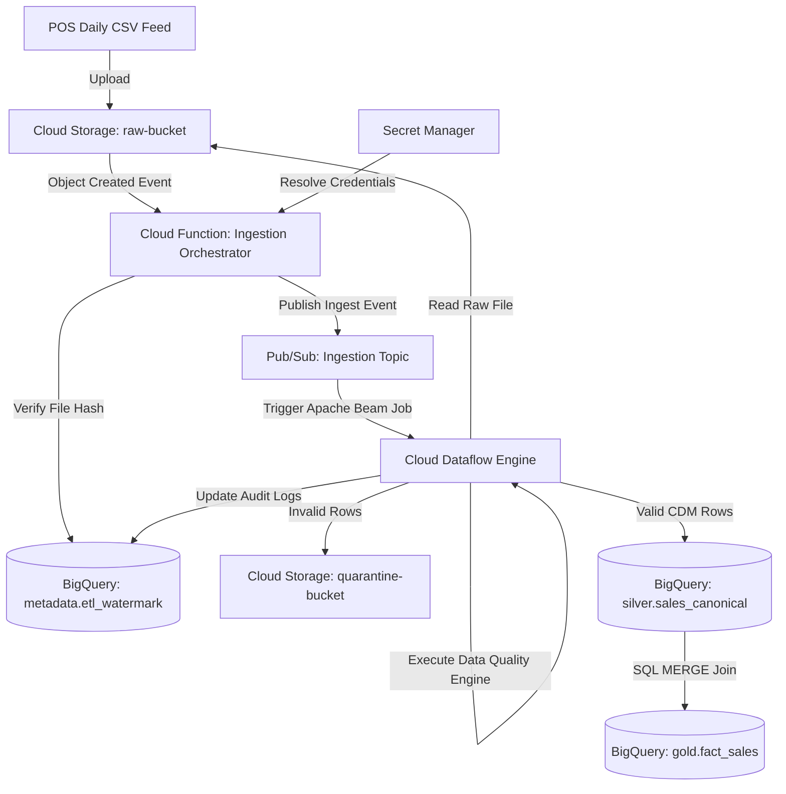

# RetailFlow ETL v2.0 — Cloud-Native Modernization Design
## Document Version: Architecture Baseline v1.0 (FROZEN)

This document serves as the official, frozen architectural baseline for modernizing the RetailFlow ETL v1.0 single-node pipeline into a serverless, cloud-native data platform on Google Cloud Platform (GCP).

---

## 1. Modernization Goals

### Business Goals
- **Eliminate Operational Overhead**: Transition from managing local VM cron schedules, local filesystems, and PostgreSQL servers to serverless, fully managed GCP services.
- **Support Store Scale Expansion**: Enable the pipeline to scale from 250 store locations to 2,500+ locations and online channels without database resource bottlenecks.
- **Lower Total Cost of Ownership (TCO)**: Shift from fixed local compute hardware costs to a pay-per-use utility model using on-demand serverless resources.

### Technical Goals
- **Serverless Execution**: Run validations, transformations, and warehouse ingestion on demand without maintaining virtual machines.
- **Decoupled Data Storage**: Migrate local directory states into highly available Google Cloud Storage (GCS) buckets.
- **Scale-Out Data Processing**: Migrate the single-node memory-bound validation and transformation layers into a distributed Google Cloud Dataflow runner.
- **Analytical Data Warehouse**: Migrate PostgreSQL transactional star schemas to Google BigQuery datasets.

### Non-Goals
- **Zero-Downtime Migration**: Continuous ingestion is not required; a scheduled nightly maintenance window is acceptable.
- **Real-Time Streaming Ingestion**: The migration targets daily batch store feed CSVs; real-time event ingestion is out of scope.
- **Multi-Cloud Portability**: The target architecture utilizes native GCP integrations.

### Success Criteria
- **100% Business Logic Integrity**: All data cleaning, normalization, validation, and metrics calculations must output the identical values as v1.0.
- **Zero Orphan Loads**: All warehouse insertions must be fully atomic; failed pipeline runs must never load partial records.
- **No Manual Infrastructure Deployment**: All resources (GCS buckets, Pub/Sub topics, Cloud Functions, BigQuery datasets, IAM roles) are deployed via infrastructure-as-code.

### Migration Principles
- **Preserve Business Logic**: Reuse the mature v1.0 Pandas cleaners, normalizers, and metric calculation formulas instead of writing them from scratch.
- **Replace Infrastructure First**: Move the storage, orchestrator, database, and logs to GCP services before rewriting core transformation code.
- **Managed Over Self-Managed**: Prioritize native, serverless GCP services to minimize operational maintenance.

---

## 2. Logical Architecture Layers

To preserve the modularity of the project and prevent it from becoming Beam-centric, we define a strict separation of layers. The execution engine (Beam) is decoupled from the core business rules:

```text
┌────────────────────────────────────────────────────────┐
│               1. Cloud Infrastructure                  │
│  - Terraform  - Cloud Scheduler  - Service Accounts   │
└──────────────────────────┬─────────────────────────────┘
                           │
                           ▼
┌────────────────────────────────────────────────────────┐
│               2. Execution Engine (Beam)               │
│  - Dataflow Runner  - Pipeline DAG  - PCollections     │
└──────────────────────────┬─────────────────────────────┘
                           │
                           ▼
┌────────────────────────────────────────────────────────┐
│                3. Application Layer                    │
│  - PipelineContext  - Storage Adapters  - Loader Ports │
└──────────────────────────┬─────────────────────────────┘
                           │
                           ▼
┌────────────────────────────────────────────────────────┐
│                4. Business Logic Layer                 │
│  - Cleaner  - Normalizer  - Validator  - Enricher      │
└──────────────────────────┬─────────────────────────────┘
                           │
                           ▼
┌────────────────────────────────────────────────────────┐
│                5. Shared Domain Models                 │
│  - Pydantic CDM schemas (CanonicalSale, etc.)          │
└──────────────────────────┬─────────────────────────────┘
                           │
                           ▼
┌────────────────────────────────────────────────────────┐
│                     6. Utilities                       │
│  - YAML Config Parser  - JSON Logger  - Redactor       │
└────────────────────────────────────────────────────────┘
```

- **Core Rule**: Business logic must remain pure-Python and must never import or depend directly on the Apache Beam SDK. Beam acts strictly as a distributed execution wrapper that calls the application and business logic layers.

---

## 3. Storage & Database Abstractions

### 1. Storage Abstraction
To isolate the pipeline from direct GCS SDK calls and support future multi-cloud storage backends, we define a `StorageProvider` interface:

```python
class StorageProvider(ABC):
    @abstractmethod
    def read_file(self, path: str) -> bytes:
        pass

    @abstractmethod
    def write_file(self, path: str, data: bytes) -> None:
        pass

    @abstractmethod
    def move_file(self, src: str, dest: str) -> None:
        pass
```

- **`LocalStorageProvider`**: Implements local path operations for testing and development.
- **`GCSStorageProvider`**: Implements GCS blob operations using `google-cloud-storage`.

### 2. Warehouse Abstraction
To decouple target loads from specific analytical databases, we define a `WarehouseClient` interface:

```python
class WarehouseClient(ABC):
    @abstractmethod
    def execute_query(self, query: str, params: dict | None = None) -> list[dict]:
        pass

    @abstractmethod
    def load_dataframe(self, df: pd.DataFrame, table: str, write_disposition: str) -> None:
        pass
```

- **`PostgresWarehouse`**: Implements the legacy loading logic.
- **`BigQueryWarehouse`**: Implements loading via the Google Cloud BigQuery client library.

---

## 4. Operational Watermark Strategy Review

We re-evaluated the watermark storage mechanism to choose between Firestore and BigQuery:

- **Option A: Google Cloud Firestore (Deferred)**: Adds another serverless service to provision, learn, and manage. Unnecessary given our daily batch ingestion volume.
- **Option B: BigQuery Metadata Table (Selected)**: Since BigQuery already acts as our analytical warehouse, keeping watermark and audit log tables in a dedicated `metadata.etl_watermark` table in BigQuery simplifies the architecture and is highly defensible in interviews:
  
> *"We already used BigQuery as our analytical warehouse, so we kept operational metadata there to reduce architectural complexity."*

---

## 5. Medallion Dataset Flow & BigQuery Write Strategy

### Medallion Layers Trade-Off Analysis

| Option | Pros | Cons | Recommendation |
|---|---|---|---|
| **Option A (Files Only)** | Lower BigQuery storage costs. | Cannot query raw messages directly in SQL. | Not recommended |
| **Option B (Files + BQ)** | True Medallion auditability; enables raw replay directly in SQL. | Minor storage cost increase. | **Selected** |

We select **Option B**. Every raw CSV file is stored in `gs://raw-bucket/` AND appended directly to `bronze.sales_raw` as a raw payload string with ingestion metadata.

### BigQuery Write Strategy
- **Selected Method**: **BigQuery Load Jobs** using the file-append configuration.
- **Rationale**: Since daily store sales are exported as batch files overnight, real-time streaming is not required. BigQuery Load Jobs are **free of ingestion cost**, support schema auto-detection, and provide robust atomic table-level write boundaries.

---

## 6. BigQuery Transformation & Loading Strategy

We compare two processing topologies:

- **Option A (Selected - ELT Model)**:
  - **Dataflow** reads from GCS, runs validation checks, normalizes data to the CDM, and writes the clean output to the `silver` dataset in BigQuery.
  - **BigQuery SQL MERGE** executes joins against Gold dimension tables to resolve surrogate keys and loads the final facts into `gold.fact_sales`.
  - **Rationale**: This is the standard enterprise ELT pattern. It keeps Dataflow focused solely on stateless row validations and cleaning, while utilizing BigQuery's query engine to perform relational joins.

- **Option B (ETL Model)**:
  - Dataflow performs validation, transformations, database lookups for surrogate keys, and writes directly to `gold.fact_sales`.
  - **Rationale**: High Dataflow worker memory overhead due to caching dimension tables locally.

---

## 7. Cloud Function & Dataflow Responsibilities

### Ingest Orchestrator (Cloud Function)
- GCS raw file detection trigger (`google.storage.object.finalize`).
- Verify file size > 0.
- Calculate file SHA-256 hash.
- Query BigQuery `metadata.etl_watermark` for duplicate hash detection.
- Publish trigger event to Pub/Sub.
- structured logging.

### Dataflow Execution (Apache Beam)
- Read raw CSV rows from GCS.
- Execute validation checks using framework-agnostic business rules.
- Write quarantined records to `gs://quarantine-bucket/`.
- Format and write clean canonical records to `silver.sales_canonical` using BigQuery Load Jobs.
- Log operational execution metrics to Cloud Logging.

---

## 8. Target System Architecture



---

## 9. BigQuery Modeling Details

- **Bronze Dataset**: `retailflow_bronze`
  - Tables: `sales_raw` (immutable raw payloads, 30-day partition expiration policy).
- **Silver Dataset**: `retailflow_silver`
  - Tables: `sales_canonical` (CDM schemas).
- **Gold Dataset**: `retailflow_gold`
  - Tables: `dim_customer`, `dim_product`, `dim_store`, `dim_employee`, `dim_date`, `fact_sales`.
- **Metadata Dataset**: `retailflow_metadata`
  - Tables: `etl_watermark`, `etl_audit_log`.
- **Partitioning**: `fact_sales` partitioned by day on `transaction_time`.
- **Clustering**: `fact_sales` clustered on `store_sk` and `product_sk`.
- **Audit Columns**: `ingestion_timestamp` (TIMESTAMP), `source_filename` (STRING), `audit_run_id` (STRING).
- **Schema Evolution**: Set `schema_update_option = ALLOW_FIELD_ADDITION` to support backward-compatible updates.

---

## 10. Logging & Observability Strategy

- **Application Logs**: Standard JSON structured output is captured by Cloud Logging.
- **Audit Logs**: Pipeline execution timelines, row counts, and status changes are written to `retailflow_metadata.etl_audit_log`.
- **Pipeline Metrics**: Latency metrics and row reject counts are sent to Cloud Monitoring as custom metrics.
- **Infrastructure Logs**: Cloud Audit Logs track GCS file uploads and BigQuery write job operations.

---

## 11. Testing & Local Development Strategy

### Test Hierarchy
- **Unit Tests**: Run locally; verify validation and transformation rules in isolation.
- **Integration Tests**: Run in CI; mock GCS and BigQuery APIs using unittest mocks.
- **DirectRunner Tests**: Run locally; verify Apache Beam transforms using Beam's `TestPipeline` wrapper.
- **Cloud Integration Tests**: Run in a pre-production sandbox to verify IAM service account credentials.
- **End-to-End Tests**: Run in a sandbox environment; trigger CF -> Pub/Sub -> Dataflow -> BigQuery flows.

### Local Development Setup
- **Beam DirectRunner**: Run Apache Beam pipelines locally using `DirectRunner` to read and write local files.
- **Local Emulator**: Use the `google-cloud-sdk` emulator to run mock GCS and BigQuery APIs locally.
- **Environment Variables**:
  ```powershell
  $env:STORAGE_PROVIDER="local"
  $env:WAREHOUSE_BACKEND="postgres"
  ```

---

## 12. Terraform Managed Infrastructure

Terraform manages:
- **GCS Buckets**: `raw-bucket`, `archive-bucket`, `quarantine-bucket`.
- **BigQuery Datasets**: `retailflow_bronze`, `retailflow_silver`, `retailflow_gold`, `retailflow_metadata`.
- **Pub/Sub**: Ingestion topics and Dataflow push subscriptions.
- **IAM**: Service accounts `sa-orchestrator` and `sa-dataflow-worker` with minimal roles.
- **Monitoring**: Alert policies for failed Dataflow jobs.

---

## 13. CI/CD Pipeline Design

### Build & Deploy Workflow (GitHub Actions)
- **Infrastructure Branch**: Staging/production infrastructure changes require `terraform plan` approval before running `terraform apply`.
- **Application Branch**: Builds Cloud Function zip archives, runs unit tests, and deploys code to Cloud Functions.
- **Rollback Strategy**: Revert to the previous git commit hash, which triggers GitHub Actions to redeploy the previous Cloud Function package version.

---

## 14. Repository Layout

```text
retailflow-etl/
├── config/                  # Environment configurations
├── deploy/                  # Terraform configurations
├── docs/                    # Architecture documentation & ADRs
├── sql/                     # BigQuery SQL & DDL setup files
├── src/retailflow/          # Main application package
│   ├── domain/              # Shared models & CDM schemas
│   ├── application/         # Core business logic & transformation rules
│   ├── adapters/            # StorageProvider & WarehouseClient implementations
│   ├── cloud/               # Cloud Function trigger entry point
│   ├── beam/                # Apache Beam pipeline transforms
│   └── utils/               # Structured logging & configuration
├── tests/                   # Test suite
└── pyproject.toml
```

---

## 15. Architecture Decision Records (ADR) Roadmap

The following ADRs will be created under `docs/adr/` during the modernization implementation:
- **`ADR-008`**: Storage Strategy (StorageProvider interface)
- **`ADR-009`**: BigQuery Adoption (BigQuery as analytical warehouse)
- **`ADR-010`**: Dataflow Execution Model (Apache Beam and Dataflow runner)
- **`ADR-011`**: Warehouse Strategy (WarehouseClient interface)
- **`ADR-012`**: Cloud Logging & Observability Design
- **`ADR-013`**: Terraform Configuration Standards
- **`ADR-014`**: Medallion Architecture (Bronze-Silver-Gold)
- **`ADR-015`**: CI/CD Release Pipeline

---

## 16. Future v3 Evolution

The following capabilities are deferred to v3:
- **Real-Time Streaming**: Ingestion via Apache Kafka and BigQuery Storage Write API.
- **Dataform / dbt Integration**: Manage SQL transforms inside the Silver-to-Gold layer using Dataform.
- **Orchestration Workflow**: Implement Cloud Composer (Airflow) for complex scheduling.

---

## 17. Final Baseline Review & Verification

### Principal Data Engineer Assessment
- **Realism**: The architecture represents a standard modern enterprise GCP data platform.
- **Hiring Manager Appeal**: The design demonstrates a solid understanding of GCP data engineering principles, and aligns well with what is expected of a candidate with 1-2 years of experience.
- **Simplicity Check**: The architecture is clean and avoids over-engineering by using serverless integrations instead of managing complex systems like Apache Airflow or Kubernetes.

### Architecture Baseline Status
We declare this document as **RetailFlow ETL v2.0 Architecture Baseline v1.0**. All future implementation milestones will align with this specification.
