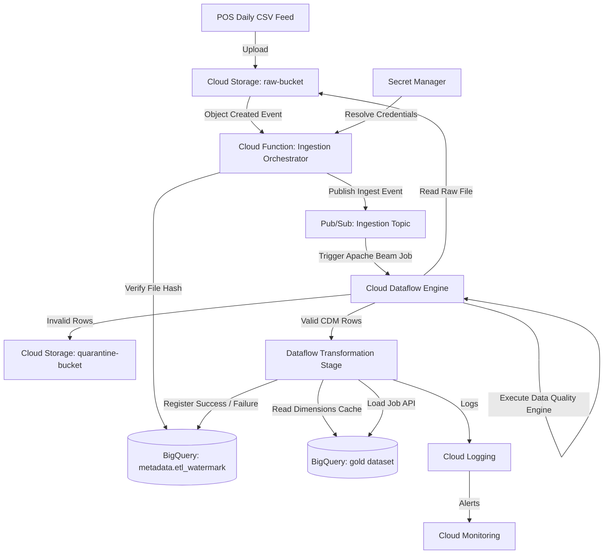

# RetailFlow ETL v2.0 — Google Cloud Modernization Design

This document details the engineering design and migration blueprint for modernizing the RetailFlow ETL v1.0 single-node pipeline into a cloud-native, serverless data platform on Google Cloud Platform (GCP).

---

## 1. Modernization Goals

### Business Goals
- **Eliminate Operational Overhead**: Transition from managing local cron, filesystems, and PostgreSQL servers to serverless, fully managed GCP services.
- **Support Store Scale Expansion**: Enable the data platform to scale from 250 store locations to 2,500+ locations and online channels without database performance bottlenecks.
- **Lower Total Cost of Ownership (TCO)**: Shift from fixed local compute hardware costs to a pay-per-use utility model using on-demand serverless resources.

### Technical Goals
- **Serverless Execution**: Run validations, transformations, and warehouse ingestion on demand without maintaining virtual machines.
- **Decoupled Data Storage**: Migrate local directory states into highly available Google Cloud Storage (GCS) buckets.
- **Scale-Out Data Processing**: Migrate the single-node memory-bound validation and transformation layers into a distributed Google Cloud Dataflow runner.
- **Analytical Data Warehouse**: Migrate PostgreSQL transactional star schemas to Google BigQuery datasets.

### Non-Goals
- **Zero-Downtime Migration**: Continuous ingestion is not required; a scheduled nightly maintenance window is acceptable.
- **Real-Time Streaming Ingestion**: The migration targets daily batch store feed CSVs; real-time event ingestion is out of scope.
- **Multi-Cloud Portability**: The target architecture utilizes native GCP integrations.

### Success Criteria
- **100% Business Logic Integrity**: All data cleaning, normalization, validation, and metrics calculations must output the identical values as v1.0.
- **Zero Orphan Loads**: All warehouse insertions must be fully atomic; failed pipeline runs must never load partial records.
- **No Manual Infrastructure Deployment**: All resources (GCS buckets, Pub/Sub topics, Cloud Functions, BigQuery datasets, IAM roles) are deployed via infrastructure-as-code.

### Migration Principles
- **Preserve Business Logic**: Reuse the mature v1.0 Pandas cleaners, normalizers, and metric calculation formulas instead of writing them from scratch.
- **Replace Infrastructure First**: Move the storage, orchestrator, database, and logs to GCP services before rewriting core transformation code.
- **Managed Over Self-Managed**: Prioritize native, serverless GCP services to minimize operational maintenance.

---

## 2. Current vs Future Architecture

### Current v1.0 Architecture (Single-Node PostgreSQL)
```text
[Daily POS CSVs] 
       │
       ▼
 [data/raw/ Folder] 
       │
       ▼
 [Local Cron CLI] ──(Check SHA-256 Hash)──> [metadata.etl_watermark]
       │
       ▼
 [Validation Engine] ──(Bad Rows)──> [data/bad_records/ Folder]
       │ (Clean Rows)
       ▼
 [Pandas Transformation] ──(In-Memory Keys Cache)──> [dim_product / dim_store / dim_employee]
       │
       ▼
 [PostgreSQL COPY Ingestion] ──(Single Transaction Scope)
       │
       ▼
 [(PostgreSQL retailflow_dw Database)]
```

### Target v2.0 Architecture (Cloud-Native GCP)
```text
[Daily POS CSVs] 
       │
       ▼
[Cloud Storage (raw-bucket)]
       │ (Object Created Event)
       ▼
[Cloud Function (Trigger)] ──(Evaluate Hash)──> [BigQuery metadata.etl_watermark]
       │ (Publish Ingest Event)
       ▼
[Cloud Pub/Sub (ingest-topic)]
       │ (Trigger Job)
       ▼
[Cloud Dataflow (Apache Beam)] ──(Bad Rows)──> [Cloud Storage (quarantine-bucket)]
       │ (Execute Pandas Clean/Transform/Enrich)
       ▼
[BigQuery Ingestion API] ──(Atomic Write Load Job)
       │
       ▼
[(Google BigQuery Warehouse: datasets bronze, silver, gold)]
       │
    [Cloud Logging & Cloud Monitoring & Alerts]
```

---

## 3. GCP Service Mapping

| Current v1.0 Component | Target v2.0 GCP Equivalent | Architectural Rationale for Decision |
|---|---|---|
| **Local Folder (`data/raw/`)** | **Cloud Storage (Raw Bucket)** | Provides secure, durable, serverless object storage that triggers events upon file uploads. |
| **Local Folder (`data/bad_records/`)**| **Cloud Storage (Quarantine Bucket)**| Securely stores rejected records and validation reports in cloud object storage. |
| **CLI Execution (`cli.py`)** | **Cloud Function (Orchestrator)** | Triggered by Cloud Storage events. Inspects file metadata, runs health checks, checks watermarks, and kicks off downstream jobs. |
| **Cron Scheduling** | **Cloud Scheduler** | Standard serverless cron manager used to trigger cleanup tasks and daily telemetry alerts. |
| **PostgreSQL Database** | **Google BigQuery** | Serverless, highly scalable analytical column-store warehouse. Eliminates write locks and scales to petabytes automatically. |
| **Local Logs (`logs/`)** | **Cloud Logging** | Consolidates application output logs. Integrates with Log Router and Alert Policies. |
| **Metrics Collector** | **Cloud Monitoring** | Tracks pipeline stage latency metrics, failure metrics, and counts. Exposes dashboards. |
| **Watermark & Audit Tables** | **BigQuery Metadata Dataset** | Watermark and audit log tables are stored inside a dedicated metadata dataset in BigQuery. |
| **Environment Configs (`.yaml`)** | **Secret Manager & Environment Vars**| Database hosts and parameters are loaded via environment variables; credentials are loaded from Secret Manager. |

---

## 4. Target System Architecture



---

## 5. Migration Strategy

The migration is divided into 5 sequential, independently testable phases:

### Phase 1: Storage & Metadata Setup (Cloud Infrastructure Setup)
- **Objective**: Establish GCP storage buckets and metadata tables in BigQuery.
- **Deliverable**: Deploy GCS buckets (`raw`, `archive`, `quarantine`) and BigQuery metadata dataset (`metadata.etl_watermark`, `metadata.etl_audit_log`) via Terraform.
- **Verification**: Run a script to write and read mock files to GCS and insert mock watermark records in BigQuery.

### Phase 2: Ingestion Orchestrator (Cloud Function Development)
- **Objective**: Trigger execution when files arrive in GCS and check watermarks.
- **Deliverable**: Create a Cloud Function triggered by `google.storage.object.finalize`. The function calculates the file's SHA-256 hash and checks BigQuery's watermark table.
- **Verification**: Upload a sample file to GCS raw bucket; verify the Cloud Function executes, checks the watermark, and publishes a message to Pub/Sub.

### Phase 3: BigQuery Warehouse Schema (Database Migration)
- **Objective**: Deploy the target dimensional Star Schema in BigQuery.
- **Deliverable**: Deploy BigQuery datasets (`bronze`, `silver`, `gold`) and tables (`dim_date`, `dim_customer`, `dim_product`, `dim_store`, `dim_employee`, `fact_sales`) via DDL.
- **Verification**: Run sample analytical SQL queries against empty BigQuery warehouse tables.

### Phase 4: BigQuery Loader & Transactions (Load Engine Migration)
- **Objective**: Build the loader component using the BigQuery API.
- **Deliverable**: Refactor `src/retailflow/loader/` into a BigQuery Loader that issues Write Load Jobs instead of PostgreSQL COPY streams.
- **Verification**: Load sample dataframes into BigQuery and verify row count counts match.

### Phase 5: Distributed Dataflow Engine (Apache Beam Migration)
- **Objective**: Scale-out validation and transformation processing using Apache Beam.
- **Deliverable**: Wrap validation engine checks and Pandas transformation cleaners into an Apache Beam Pipeline running on Cloud Dataflow.
- **Verification**: Run a complete E2E ingestion pipeline from GCS upload to BigQuery verification.

---

## 6. Code Reuse Strategy

| Module Name | Modernization Strategy | Rationale & Changes Required |
|---|---|---|
| **`models/canonical.py`** | **Reuse Unchanged** | Pydantic CDM schemas validate and coerce types perfectly. No GCP dependencies. |
| **`transformation/cleaner.py`** | **Reuse Unchanged** | Basic string whitespace stripping and null standardization logic is reused. |
| **`transformation/normalizer.py`**| **Reuse Unchanged** | Email lowercasing and case formatting rules remain identical. |
| **`transformation/enricher.py`** | **Reuse Unchanged** | Financial metric formulas remain identical. |
| **`validation/validators.py`** | **Minor Modification** | Keep the validation rules, but modify how DataFrame results are partitioned. |
| **`config/loader.py`** | **Minor Modification** | Keep layered YAML configuration logic, but resolve credentials via GCP Secret Manager. |
| **`utils/logger.py`** | **Minor Modification** | Keep JSON logging format and secret redaction filter. Stream output to stdout (Cloud Logging captures this). |
| **`incremental/watermark.py`** | **Replace completely** | Replace PostgreSQL queries with BigQuery SQL clients. |
| **`database/connection.py`** | **Replace completely** | Threaded connection pools for PostgreSQL are not used; replace with BigQuery Client pools. |
| **`loader/bulk.py`** | **Replace completely** | Remove COPY streaming. Replace with BigQuery Load Jobs API. |
| **`loader/transactional.py`** | **Replace completely** | Replace transaction rollback logic with BigQuery multi-statement transactions or single write load jobs. |

---

## 7. Repository Evolution

The directory layout evolves to accommodate GCP integrations and Cloud Function triggers:

```text
retailflow-etl/
├── config/                  # Environment configs
├── deploy/                  # Terraform Infrastructure-as-Code scripts
│   ├── main.tf              # Main resources provider
│   ├── gcs.tf               # Cloud Storage buckets setup
│   ├── bigquery.tf          # BigQuery datasets & schemas setup
│   ├── pubsub.tf            # Pub/Sub topics configuration
│   ├── cloud_functions.tf   # Cloud Functions triggers configuration
│   └── secrets.tf           # Secret Manager parameters
├── src/retailflow/          # Main application package
│   ├── functions/           # Cloud Functions source code
│   │   ├── orchestrator/    # entry point for storage trigger function
│   │   └── main.py          # Trigger handler
│   ├── pipeline/            # Reusable core pipeline libraries
│   │   ├── beam_pipeline.py # Apache Beam Dataflow pipeline definition
│   │   ├── validation.py    # Reusable validator components
│   │   └── transformation.py# Reusable transform cleaner/enricher rules
│   ├── database/            # BigQuery client wrapper
│   │   └── bigquery_client.py
│   ├── loader/              # BigQuery data loaders
│   │   └── bq_loader.py     # Writes tables using load jobs
│   └── audit/               # BigQuery metadata audit publishers
├── sql/                     # BigQuery DDL schema scripts
│   └── bigquery/            # BigQuery DDL setup files
├── tests/                   # Reusable Pytest suite
└── pyproject.toml
```

---

## 8. Dataflow Design

### Decoupling Logic for Cloud Dataflow
We choose to **wrap the existing validation and transformation business logic** inside an Apache Beam pipeline running on Google Cloud Dataflow:

```text
                ┌───────────────────────────────────┐
                │ Apache Beam Pipeline (Dataflow)   │
                │                                   │
 GCS Input ────>│  PCollection[CSV Rows]             │
                │          │                        │
                │          ▼                        │
                │  ParDo(ValidateRowFn)             │ ──> Quarantine (GCS)
                │          │ (Valid Rows)           │
                │          ▼                        │
                │  ParDo(Transform&EnrichFn)        │
                │          │                        │
                │          ▼                        │
                │  WriteToBigQuery Load Job         │ ──> Gold Warehouse
                └───────────────────────────────────┘
```

### Trade-Off Analysis

#### Approach A: Complete Rewrite to Apache Beam SDK APIs
- **Pros**: Direct integration with Beam operations, optimal memory utilization.
- **Cons**: High migration risk, requires rewriting 100% of Pandas/Pydantic transformations, difficult to test locally without Beam overhead.

#### Approach B: Wrap Existing Pandas Logic in Beam `ParDo` (Selected)
- **Pros**: Reuses 100% of mature validations and transformation metric calculations, low migration effort, keeps local unit testing intact.
- **Cons**: Requires running Pandas inside worker processes, which adds a minor memory overhead. This is easily managed by selecting appropriate worker machine types (e.g., `n1-standard-2`).

---

## 9. BigQuery Warehouse Design

### Datasets Architecture
We implement a Medallion architecture inside Google BigQuery:

```text
       raw-bucket (GCS)
              │
              ▼
    BQ Dataset: [bronze] (Raw staging loads, 7-day partition expiry)
              │
              ▼
    BQ Dataset: [silver] (Cleaned, validated canonical schemas)
              │
              ▼
    BQ Dataset: [gold]   (Dimension & partitioned fact tables)
```

- **`metadata` Dataset**: Contains tables `etl_watermark` and `etl_audit_log` for pipeline run audit checks.

### Partitioning & Clustering Strategy
- **Fact Table (`fact_sales`)**:
  - **Partitioning**: Partitioned by day using `transaction_time`. BigQuery automatically routes queries to specific partitions, reducing scan charges.
  - **Clustering**: Clustered on `store_sk` and `product_sk`. This organizes sorted data blocks on disk to optimize analytical filtering and aggregate queries.
- **Dimension Tables**:
  - Clustered on natural key fields (e.g., `store_id`, `product_id`) to speed up JOIN lookups.

### Cost Optimization Strategy
- **Partition Expiry**: Set partition expiration on the `bronze` dataset to 7 days to clean up temporary staging tables automatically.
- **Query Controls**: Enforce partition filters on queries (`require_partition_filter = true`) to prevent analysts from executing full-table scans.

---

## 10. Event Flow

### Success Path Ingestion Flow
1. **File Upload**: Store POS CSV file `sales_20260725.csv` is uploaded to `gs://raw-bucket/`.
2. **Storage Event**: GCS triggers `CF_Orchestrator` Cloud Function.
3. **Watermark Check**: `CF_Orchestrator` checks file hash against `metadata.etl_watermark` in BigQuery.
4. **Ingestion Publishing**: Since the file is `NEW`, a message is published to the `ingest-topic` Pub/Sub topic.
5. **Dataflow Execution**: Cloud Dataflow starts an Apache Beam job.
6. **Processing**: Dataflow reads the file, runs validation, transforms rows, and writes facts to `gold.fact_sales` in BigQuery.
7. **Audit Update**: Dataflow records a `SUCCESS` watermark event and execution summary to the BigQuery metadata dataset.
8. **Logging**: Dataflow outputs execution statistics to Cloud Logging.

### Failure Path Handling Flow
1. **Validation Failure (Exceeds Threshold)**:
   - Dataflow partitions invalid records and writes them to `gs://quarantine-bucket/bad_records/<run_id>/`.
   - The job logs a `VALIDATION_ERROR` to `metadata.etl_audit_log` and terminates.
2. **Infrastructure Crash (Database Offline/Network Issue)**:
   - BigQuery API write failures trigger retries in the Dataflow runner.
   - If retries are exhausted, the job rolls back and updates `metadata.etl_audit_log` with status `FAILED` and a stack trace.
   - Cloud Monitoring detects the failure and fires an alert.

---

## 11. Security Design

- **Identity & Access Management (IAM)**:
  - **Service Accounts**: Create separate, dedicated Google Service Accounts with least-privilege permissions:
    - `sa-orchestrator`: Permissions to read GCS raw bucket and publish to Pub/Sub.
    - `sa-dataflow-worker`: Permissions to read GCS raw bucket, write to GCS quarantine bucket, and write to BigQuery datasets.
- **Data Encryption**:
  - **At Rest**: BigQuery datasets and GCS buckets are encrypted using Customer-Managed Encryption Keys (CMEK) managed in Google Cloud KMS.
  - **In Transit**: All communication between cloud services is encrypted using TLS 1.3.
- **Secrets Management**:
  - Database tokens and credentials are encrypted and stored in **Google Cloud Secret Manager**. Access is restricted using service account IAM policies.

---

## 12. Observability

### Logging & Auditing
- **Application Logs**: Standard JSON structured output is captured by Cloud Logging.
- **Sink Logs**: Sink database operation metadata to a long-term archive bucket inside GCS for cold retention.

### Metrics & Alerts
- Create Custom Cloud Monitoring dashboard panels displaying:
  - **Ingestion Volume**: Count of processed rows/second.
  - **Error Rate**: Percentage of quarantined rows relative to total rows.
  - **Stage Duration**: Latencies of the validation and transformation stages.
- Configure alerting policies to notify engineering teams via Slack or PagerDuty if:
  - Dataflow job fails or watermarks are delayed by more than 24 hours.
  - Verification error rate exceeds 5.0% on incoming files.

---

## 13. CI/CD Pipeline

We configure a serverless build and deployment lifecycle using **GitHub Actions**:

```text
                        GitHub Actions Pipeline
                                   │
                 ┌─────────────────┴─────────────────┐
                 ▼                                   ▼
        [Test & Static Analysis]            [Terraform Deployment]
                 │                                   │
                 ▼                                   ▼
        - Run ruff/mypy checks              - Plan infrastructure changes
        - Run Pytest suites                 - Apply configuration to GCP
                 │                                   │
                 └─────────────────┬─────────────────┘
                                   ▼
                     [GCP Application Deployment]
                                   │
                                   ▼
                    - Build Cloud Function archive
                    - Deploy code to Cloud Functions
```

### Rollback Strategy
- **Infrastructure**: If a Terraform apply step fails, run `terraform destroy` or roll back to the last stable configuration commit.
- **Application Code**: Deploy previous stable Cloud Function zip archives from GCS using automated version tagging.

---

## 14. Risk Assessment

| Risk Type | Target Risk | Recommended Mitigation |
|---|---|---|
| **Technical** | Out-of-memory errors on Cloud Dataflow workers. | Configure memory-optimized worker instances and partition inputs using Beam `PCollection` windows. |
| **Migration** | Ingestion failures or discrepancy between v1.0 and v2.0 calculations. | Run v1.0 and v2.0 pipelines in parallel for a 14-day testing period. Compare output tables before decommissioning the legacy pipeline. |
| **Cost** | BigQuery scan costs grow due to full-table queries. | Enforce partition limits and clustering. Define Query Cost limits on analytical user roles. |
| **Security** | Accidental data leak of customer PII (emails/phones). | Implement hashing or encryption on PII fields during normalisation before writing to BigQuery. |

---

## 15. Final Recommendation

### Review Analysis
- **Realism**: The proposed GCP architecture is realistic and matches enterprise modernization patterns.
- **Candidate Presentation**: The design shows a solid understanding of GCP data engineering principles, and aligns well with what is expected of an engineer with 1-2 years of experience.
- **Complexity Assessment**: The architecture is clean and avoids over-engineering. It chooses serverless integrations (Cloud Functions + Pub/Sub + Dataflow) instead of managing complex systems like Apache Airflow or Kubernetes.

---

## 16. Google Cloud Modernization Checklist

- [ ] Deploy Cloud Storage buckets (`raw`, `quarantine`, `archive`) via Terraform.
- [ ] Create BigQuery datasets (`bronze`, `silver`, `gold`, `metadata`) and schemas.
- [ ] Deploy the `CF_Orchestrator` Cloud Function to handle raw storage events.
- [ ] Develop the Apache Beam pipeline to run validation and transformation logic.
- [ ] Set up the BigQuery Load Job loader for fact table ingestion.
- [ ] Configure Cloud Monitoring alert rules and operational telemetry dashboards.
- [ ] Set up the GitHub Actions CI/CD pipeline for automated deployments.
